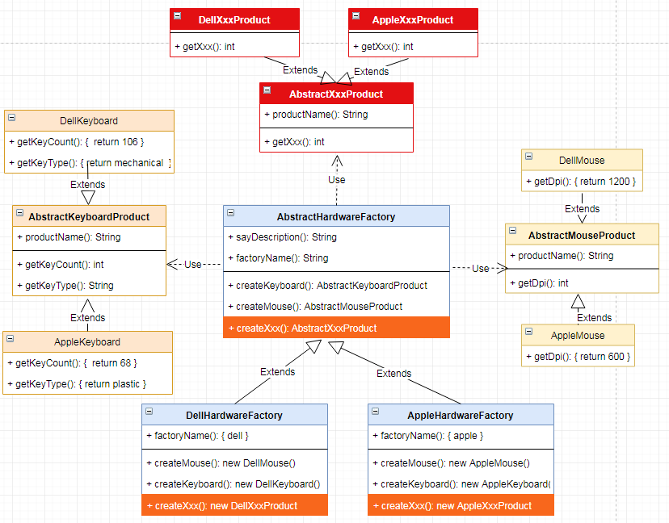

# 抽象工厂 `Abstract Factory`

| :sparkles:模式类型:sparkles::sparkles:|:sparkles::sparkles:难度:sparkles:  :sparkles: | :sparkles::sparkles:实用性:sparkles::sparkles: | :sparkles::sparkles:重要程度:sparkles::sparkles: |  :sparkles::sparkles:经典性:sparkles::sparkles: | :sparkles::sparkles:历史性:sparkles: |
| :----------------------------------------: | :-----------------------------------------------: | :-------------------------------------------------: | :----------------------------------------------------: | :--------------------------------------------------: | :--------------------------------------: |
|              创造型模式                              |                ★★★★★ :arrow_down:                 |                  ★★★★★ :arrow_up:                   |                    ★★★★★ :arrow_up:                    |              :green_heart:  :arrow_up:               |        :green_heart:  :arrow_up:         |

## 概念
抽象工厂模式(`Abstract Factory`)，抽象工厂模式又称为Kit模式，属于对象创建型模式。抽象工厂是提供一个创建**一系列相关或相互依赖对象的接口，而无须指定它们具体的类**，接口是负责创建一个相关对象的工厂，不需要显式指定它们的类，每个生成的工厂都能按照工厂模式提供对象；抽象工厂**围绕一个超级工厂创建其他工厂，提供一个接口，用于创建 相关的对象家族**。

## 用途
+ 抽象工厂主要解决接口选择的问题，它可以创造一系列的工厂实例让客户选择，通过选择不同的工厂实例可以创建具体的产品对象。在一个系统中，如果有多套不同的产品（产品族），而系统只消费其中某一族的产品，这个时候使用抽象工厂模式非常适合。
+ 在工厂方法中，具体的工厂负责具体的产品的生产，每个工厂都会对应一个产品。所以工厂方法具有产品唯一性，一个工厂一般只提供一个方法实例化产品。有时候我们需要一个工厂能够生产多个产品或是一个超级产品中组成的很多小产品，而不是单一的产品。
	- 产品等级结构：产品的等级结构即产品的继承结构，如一个抽象类是电视机，其子类有海尔电视机、海信电视机、TCL电视机，则抽象电视机与具体品牌的电视机之间构成了一个产品等级结构，抽象电视机是父类，而具体品牌的电视机是其子类。
	- 产品簇：在抽象模式中，产品簇即是由同一个工厂生产的，位于不同产品等级结构中的产品。如海尔电器工厂生产的海尔电视机、海尔电冰箱，海尔电视机位于电视机产品等级结构中，海尔电冰箱位于电冰箱产品等级结构中。
+ 当系统所提供的工厂生产的产品并不是一个简单的对象，而是多个位于不同产品等级结构中的产品并且属于不同类型的具体产品，这时候需要使用工厂模式。
+ 抽象工厂模式是所有形式的工厂模式中最为抽象和最具一般性的一种形态
+ 抽象工厂模式和工厂方法最大的区别：
	- 工厂方法是针对一种特定的产品的等级结构，它只生产一种具体的产品
	- 抽象工厂则是针对不同的产品等级结构，是一个产品簇，它生产不同的小产品组成的一套产品
	- 一个工厂等级结构可以负责多个不同产品等级结构中的产品对象的创建 
	- 当一个工厂等级结构可以创造分别属于不同产品等级结构的一个产品簇中的所有对象时，抽象工厂模式比工厂方法模式更简单、更有效率
	
+ 工厂方法模式只有一个抽象产品类，而抽象工厂模式有多个。   
+ 工厂方法模式的具体工厂类只能创建一个具体产品类的实例，而抽象工厂模式可以创建多个。
	 工厂方法创建 "一种" 产品，他的着重点在于"怎么创建"，也就是说如果你开发，你的大量代码很可能围绕着这种产品的构造，初始化这些细节上面。也因为如此，类似的产品之间有很多可以复用的特征，所以会和模版方法相随。	

## 模式架构
抽象工厂方法可以说整合了工厂方法模式，像是一个更高级更大的工厂模式，只不过抽象工厂产生的是多个具体的工厂实例，每个工厂实例又可以实例化不同的具体工厂产品。抽象工厂可以生成一批不同的产品工厂，从而生产不同的具体产品。

### 参与角色对象
+ AbstractFactory：工厂接口、工厂抽象类，提供生产不同的产品工厂的抽象类
+ XxxConcreteFactory：具体工厂，继承抽象工厂类，将要生产产品的“工厂”的业务逻辑封装在工厂类而不对外暴露
+ AbstractProduct：抽象产品、产品接口，提供统一的产品定制模型，定制一套规范规格化的产品
+ XxxProduct：具体产品，提供构建不同的产品对象

### UML关系图

## 优点与缺点
+ **优点**
	- 当一个产品族中的多个对象被设计成一起工作时，它能保证客户端始终只使用同一个产品族中的对象。
	- 抽象工厂模式隔离了类的生成，使得客户端无需知道类是如何生成的。由于这种隔离的内聚低耦合的情况，使得更换一个具体的工厂变动容易。所有的具体工厂都实现了抽象工厂中定义的那些功能接口，因此只需用改变具体的实例，就可以改变整个工厂的具体产品线。另外，应用抽象工厂模式可以实现高内聚低耦合的设计目的，因此抽象工厂模式得到了广泛的应用。
	- 当一个产品簇中的多个对象被设计成一起工作时，它能够保护客户端始终只使用同一个工厂的产品簇中的产品对象。这对一些需要根据系统环境（如：系统数据源）来决定使用那一套产品来说，是一种非常实用的设计模式。
	- 增加新的具体工厂和产品族很方便，无须修改已有系统，符合“开闭原则”。
	
+ **缺点**
	- 产品族扩展非常困难，要增加一个系列的某一产品，既要增加抽象的产品和产品的具体实现，有需要在抽象工厂中增加具体产品工厂，有需要完成抽象工厂的实现。
	- 在添加新的产品对象时，难以扩展抽象工厂来生产新种类的产品，这是因为在抽象工厂角色中规定了所有可能被创建的产品集合，要支持新种类的产品就意味着要对该接口进行扩展，而这将涉及到对抽象工厂角色及其所有子类的修改，显然会带来较大的不便。
	- 开闭原则的倾斜性（增加新的工厂和产品族容易，增加新的产品等级结构麻烦）。

## 代码实现
抽象工厂的实现要点如下：
+ 需要定义产品接口或抽象类，定制需要实现产品的功能方法
+ 每个具体的产品需要实现产品接口或抽象类，完成方法功能的实现
+ 工厂类是一个抽象类，定义工厂的抽象方法，让具体的产品工厂去实现该方法返回工厂的实例
+ 工厂产品子类需要继承工厂类，完成产品工厂的创建实例化

### 示例参考
+ [抽象工厂](./java/io/github/hooj0/abstractfactory/)

## 应用场景
在一个系统中，如果有多套不同的产品（产品族），而系统只消费其中某一族的产品，这个时候使用抽象工厂模式非常适合。大部分抽象工厂模式都是一堆工厂方法，每个工厂方法返回某种类型的对象。比如说工厂可以生产鼠标和键盘。那么抽象工厂的实现类（它的某个具体子类）的对象都可以生产鼠标和键盘，但可能工厂A生产的是罗技的键盘和鼠标，工厂B是微软的。
这样A和B就是工厂，对应于抽象工厂。每个工厂生产的鼠标和键盘就是产品，对应于工厂方法。用了工厂方法模式，你替换生成键盘的工厂方法，就可以把键盘从罗技换到微软。但是用了抽象工厂模式，你只要换家工厂，就可以同时替换鼠标和键盘一套。如果你要的产品有几十个，当然用抽象工厂模式一次替换全部最方便（这个工厂会替你用相应的工厂方法）所以说抽象工厂就像工厂，而工厂方法则像是工厂的一种产品生产线。

## 应用实例参考

### `JavaSDK` 
+ java.util.Calendar#getInstance()
+ java.util.Arrays#asList()
+ java.util.ResourceBundle#getBundle()
+ java.sql.DriverManager#getConnection()
+ java.sql.Connection#createStatement()
+ java.sql.Statement#executeQuery()
+ java.text.NumberFormat#getInstance()
+ javax.xml.transform.TransformerFactory#newInstance()

### `GoSDK`

### `PythonSDK`

### `JavaScript Libs`

## 总结

## 参考资料

