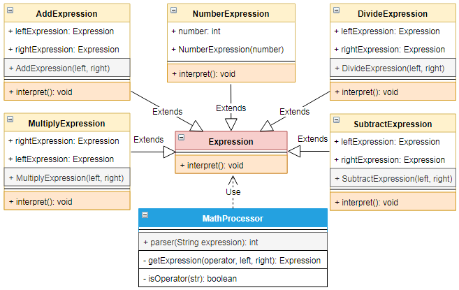

# 解释器 `Interpreter`

| :sparkles:模式类型:sparkles::sparkles:|:sparkles::sparkles:难度:sparkles:  :sparkles: | :sparkles::sparkles:实用性:sparkles::sparkles: | :sparkles::sparkles:重要程度:sparkles::sparkles: |  :sparkles::sparkles:经典性:sparkles::sparkles: | :sparkles::sparkles:历史性:sparkles: |
| :----------------------------------------: | :-----------------------------------------------: | :-------------------------------------------------: | :----------------------------------------------------: | :--------------------------------------------------: | :--------------------------------------: |
|                 行为型模式                           |                ★★★★ :arrow_down:                 |                  ★★★ :arrow_up:                   |                    ★★★ :arrow_up:                    |              :green_heart:  :arrow_up:               |        :green_heart:  :arrow_up:         |

## 概念
解释器模式(`Interpreter Pattern`)提供了评估语言的**语法或表达式**的方式，它属于**行为型模式**。这种模式实现了一个**表达式接口**，该接口**解释一个特定的上下文**。这种模式被**用在 `SQL` 解析、符号处理引擎**等。可利用场景比较少，`JAVA` 中如果碰到可以用 `expression4J` 库去实现。

## 用途
给定一个语言，定义它的**文法表示**，并定义一个**解释器**，这个解释器使用该标识来**解释语言**中的句子。主要解决对于一些**固定文法**构建一个**解释句子**的解释器。

## 模式架构
使用表达式**解析一个复杂**的语句，利用**不同解释器**的组合构建一个**复杂又简单**的表达式语句。

### 参与角色对象
+ **`Context` 上下文角色**：包含解释器之外的一些全局信息。
+ **`AbstractExpression` 抽象表达式角色**：抽象出公共的表达式部分，提供子表达式继承使用。
+ **`TerminalExpression` 终结符表达式角色**：每个终结符都需要一个 `TerminalExpression`。
+ **`NonTerminalExpression` 具体表达式角色**：实现具体的表达式，完成一个语句中的一个部分的解释。

### UML关系图

## 优点与缺点
+ **优点**
	- 可扩展性比较好，灵活。可以进行不同的解释器对象组合，构建复杂的语句。 
	- 增加了新的解释表达式的方式。 通过对象的方式可以表达复杂的语句。
	- 易于实现简单文法。只需用实现`interpreter`接口中的方法，将解释器对象进行组合叠加就能完成。
	
+ **缺点**
	- 可利用场景比较少。 
	- 对于复杂的文法比较难维护。
	- 解释器模式会引起类膨胀。 
	- 解释器模式采用递归调用方法。

## 代码实现
解释器模式的实现要点如下：
+ 定义上下文角色对象`Context`用于接收解析的表达式字符串数据信息。
+ 定义抽象表达式角色`AbstractExpression`，提供抽象方法`interpret()`用于计算单个表达式组合结果。
+ 定义终结符表达式角色`TerminalExpression`，继承`AbstractExpression`，接收字符串将其转换为独立的结果，用于计算表达式之间的数据运算，并实现抽象方法`interpret()`返回转换后的数据。
+ 定义具体表达式角色`NonTerminalExpression`，继承`AbstractExpression`，接收两个`AbstractExpression`的构造参数，并实现抽象方法`interpret()`，计算出结果。

### 示例参考
+ [解释器模式](./java/io/github/hooj0/interpreter/)

## 应用场景
解释器模式适用于：
+ 可以将一个需要解释执行的语言中的句子表示为一个抽象语法树。当存在要**解释的语言**时，请使用解释器模式，并且可以将语言中的**语句表示为抽象语法树**。
+ 语法很简单。对于复杂的语法，语法的**类层次结构变得庞大且难以管理**。在这种情况下，**解析器生成器**等工具是更好的选择。他们可以**解释表达式**而**无需构建抽象语法树**，这可以**节省空间和可能的时间**。
+ 效率不是一个关键问题。最有效的解释器通常**不是通过直接解释解析树**而是通过首先将它们**翻译成另一种形式**来实现的。例如，正则表达式通常会转换为**状态机**。但即便如此，翻译器也可以通过`Interpreter`模式实现，因此模式仍然适用。
+ 一些重复出现的问题可以用一种简单的语言来进行表达。 一个简单语法需要解释的场景。

## 应用实例参考

### `JavaSDK` 

- [`java.util.Pattern`](http://docs.oracle.com/javase/8/docs/api/java/util/regex/Pattern.html)
- [`java.text.Normalizer`](http://docs.oracle.com/javase/8/docs/api/java/text/Normalizer.html)
- [`java.text.Format - all subclasses`](http://docs.oracle.com/javase/8/docs/api/java/text/Format.html)
- [`javax.el.ELResolver`](http://docs.oracle.com/javaee/7/api/javax/el/ELResolver.html)

### `GoSDK`

### `PythonSDK`

### `JavaScript Libs`

## 总结
+ 解释器模式实现了一个表达式接口，该接口解释一个特定的上下文。这种模式被用在 `SQL` 解析、符号处理引擎等。
+ 解释器模式给定一个语言，定义它的**文法表示**，并定义一个**解释器**，这个解释器使用该标识来**解释语言**中的句子。主要解决对于一些**固定文法**构建一个**解释句子**的解释器。
+ 解释器模式优点：可扩展性比较好，灵活。可以进行不同的解释器对象组合，构建复杂的语句；增加了新的解释表达式的方式。 通过对象的方式可以表达复杂的语句；易于实现简单文法。只需用实现`interpreter`接口中的方法，将解释器对象进行组合叠加就能完成。
+ 解释器模式使用场景： 可以将一个需要解释执行的语言中的句子表示为一个抽象语法树；一些重复出现的问题可以用一种简单的语言来进行表达；一个简单语法需要解释的场景。

## 参考资料

