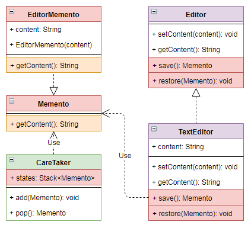

# 备忘录 `Memento`

| :sparkles:模式类型:sparkles::sparkles:|:sparkles::sparkles:难度:sparkles:  :sparkles: | :sparkles::sparkles:实用性:sparkles::sparkles: | :sparkles::sparkles:重要程度:sparkles::sparkles: |  :sparkles::sparkles:经典性:sparkles::sparkles: | :sparkles::sparkles:历史性:sparkles: |
| :----------------------------------------: | :-----------------------------------------------: | :-------------------------------------------------: | :----------------------------------------------------: | :--------------------------------------------------: | :--------------------------------------: |
|                     行为型模式                       |                ★★★★ :arrow_down:                 |                  ★★★ :arrow_up:                   |                    ★★★ :arrow_up:                    |              :green_heart:  :arrow_up:               |        :green_heart:  :arrow_up:         |

## 概念
备忘录模式(`Memento Pattern`)**在不违反封装的情况下，保存一个对象的内部状态**，以便稍后可以将对象**恢复到此状态**。备忘录模式属于**行为型模式**。

## 用途
在**不破坏封装性**的前提下，捕获一个对象的**内部状态**，并在该**对象之外保存这个状态**。主要解决**在不破坏封装**的前提下，捕获一个对象的**内部状态**，并在**该对象之外**保存这个状态，这样可以在以后将对象**恢复到原先保存**的状态。

## 模式架构
**在不破坏封装**的前提下，捕获一个对象的**内部状态**，并在**该对象之外**保存这个状态，这样可以在以后将对象**恢复到原先保存**的状态。

### 参与角色对象
+ **`Originator`：原始对象**，创建并在 ` Memento` 对象中存储状态。
+ **`Caretaker`：负责保存好备忘录**，负责从  `Memento` 中恢复对象的状态。
+ **`Menento`：备忘录**，存储原始对象的的状态，即包含了要被恢复的对象的状态。备忘录实际上有两个接口，一个是提供给 `Caretaker` 的窄接口：它只能**将备忘录传递给其它对象**；一个是提供给 `Originator` 的宽接口，允许它访问到**先前状态所需的所有数据**。理想情况是**只允许 `Originator` 访问本备忘录的内部状态**。

### UML关系图

## 优点与缺点
+ **优点**
	+ 给用户提供了一种可以**恢复状态**的机制，可以使用户能够**比较方便地回到某个历史的状态**。 
	+ 实现了**信息的封装**，使得用户**不需要关心状态的保存细节**。
+ **缺点**
	+ **消耗资源**。如果类的**成员变量过多**，势必会**占用比较大**的资源，而且每一次保存都会**消耗一定的内存**。

## 代码实现
备忘录模式的实现要点如下：
+ 定义 `Originator` 原始对象接口，并实现其接口中的方法，在原始对象接口中提供设置状态和获取状态的方法，同时提供保存状态和恢复状态的方法。
+ 定义 `Caretaker` 负责保存 `Memento` 对象的方法，并支持将保存 `Memento` 对象再恢复之前的状态数据。
+ 定义 `Menento` 对象负责保存对象状态的保存和获取操作。

### 示例参考
+ [备忘录模式 - 花开花落](./java/io/github/hooj0/memento/flower)
+ [备忘录模式 - 编辑器](./java/io/github/hooj0/memento/editor)

## 应用场景
备忘录模式适用于：
+ 需要保存/恢复数据的相关状态场景，必须保存对象**状态的快照**，以便以后可以将其**恢复到该状态**。
+ 获取状态的直接接口将**暴露实现细节**并破坏对象的封装。
+ 提供一个**可回滚**的操作。

## 应用实例参考

### `JavaSDK` 
+ `java.util.Date`
+ `java.io.Serializable`

### `GoSDK`

### `PythonSDK`

### `JavaScript Libs`

## 总结