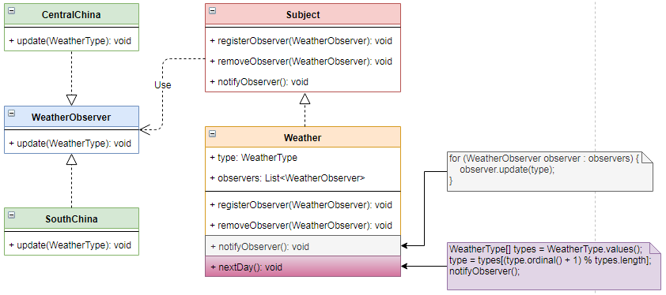

# 观察者 `Observer`

| :sparkles:模式类型:sparkles::sparkles:|:sparkles::sparkles:难度:sparkles:  :sparkles: | :sparkles::sparkles:实用性:sparkles::sparkles: | :sparkles::sparkles:重要程度:sparkles::sparkles: |  :sparkles::sparkles:经典性:sparkles::sparkles: | :sparkles::sparkles:历史性:sparkles: |
| :----------------------------------------: | :-----------------------------------------------: | :-------------------------------------------------: | :----------------------------------------------------: | :--------------------------------------------------: | :--------------------------------------: |
|                  行为型模式                          |                ★★★ :arrow_down:                 |                  ★★★★ :arrow_up:                   |                    ★★★★ :arrow_up:                    |              :green_heart:  :arrow_up:               |        :green_heart:  :arrow_up:         |

## 概念
观察者模式(`Observer Pattern`)：定义对象间的**一种一对多**依赖关系，使得每当一个对象**状态发生改变**时，其**相关依赖对象皆得到通知并被自动更新**。观察者模式又叫做**发布-订阅**（`Publish/Subscribe`）模式、**模型-视图**（`Model/View`）模式、**源-监听器**（`Source/Listener`）模式或**从属者**（`Dependents`）模式。观察者模式是一种对象**行为型模式**。

## 用途
建立一种对象与对象之间的**依赖关系**，一个对象发生改变时将**自动通知其他对象**，其他对象将**相应做出反应**。在此，发生改变的对象称为**观察目标**，而被通知的对象称为**观察者**，**一个观察目标可以对应多个观察者**，而且这些观察者之间**没有相互联系**，可以根据需要**增加和删除**观察者，使得系统更**易于扩展**。且要考虑到**易用和低耦合**，保证**高度的协作**。

## 模式架构
+ 观察者模式描述了**如何建立对象与对象之间的依赖关系**，如何构造满足这种需求的系统。
+ 这一模式中的关键对象是**观察目标和观察者**，一个目标可以有**任意数目**的与之相依赖的观察者，一旦目标的状态发生改变，**所有的观察者都将得到通知**。
+ 作为对这个通知的响应，**每个观察者都将即时更新自己的状态**，以与目标状态**同步**，这种交互也称为**发布-订阅**(`publish subscribe`)。目标是通知的**发布者**，它发出**通知时并不需要知道谁是它的观察者**，可以**有任意数目的观察者订阅它并接收通知**。

### 参与角色对象
+ **`Subject`: 目标**，具有**注册和移除观察者、并通知所有观察者的功能**，主题是通过维护一张观察者列表来实现这些操作的。
+ **`ConcreteSubject`: 具体目标**，实现`Subject`接口并完成**观察者注册、移除观察者、通知观察者**。
+ **`Observer`: 观察者**，注册功能需要调用主题的  `registerObserver()` 方法。
+ **`ConcreteObserver`: 具体观察者**，可以有多个不同的观察者对目标进行观察。

### UML关系图

## 优点与缺点
+ **优点**
	- 建立一套触发机制。
	- 观察者模式可以实现**表示层和数据逻辑层**的**分离**，并定义了**稳定的消息更新传递机制**，抽象了更新接口，使得可以有**各种各样不同的表示层**作为具体观察者角色。
	- 观察者模式在**观察目标和观察者**之间建立一个**抽象的耦合**。
	- 观察者模式支持**广播通信**。
	- 观察者模式符合“**开闭原则**”的要求。
	
+ **缺点**
	- 如果一个被**观察者对象有很多的直接和间接的观察者**的话，将所有的观察者都通知到会**花费很多时间**。 
	- 如果在观察者和观察目标之间**有循环依赖**的话，观察目标会触发它们之间**进行循环调用**，可能**导致系统崩溃**。 
	- 观察者模式**没有**相应的机制让观察者知道所观察的目标对象是**怎么发生变化**的，而**仅仅只是知道观察目标发生了变化**。

## 代码实现
观察者模式的实现要点如下：
+ 定义 `Subject` 目标接口，声明**观察者注册、移除观察者、通知观察者**的接口方法。
+ 定义 `ConcreteSubject` 具体目标，实现`Subject` 目标接口。同时实现**观察者注册、移除观察者、通知观察者**的接口方法，并额外提供通知所有观察者改变状态的方法，在方法中调用 `notifyObserver`。
+ 定义 `Observer` 观察者接口，提供改变状态的接口方法。
+ 根据需要定义多个`ConcreteObserver` 具体观察者实现类，实现`Observer` 观察者接口并完成改变状态的接口方法。

### 示例参考
+ [观察者模式](./java/io/github/hooj0/observer)

## 应用场景
观察者模式适用于：
+ 当抽象有两个方面时，**一个依赖于另一个**。将这些方面**封装在单独的对象**中可让您**独立地改变和重用**它们。
+ 当**一个对象应该能够通知其他对象**而不假设这些对象是谁。换句话说，您不希望这些对象**紧密耦合**。
+ 一个对象的改变将**导致其他一个或多个对象**也发生改变，而不知道**具体有多少对象**将发生改变，可以降低对象之间的**耦合度**。
+ 需要在系统中创建一个**触发链**，A对象的行为将影响B对象，B对象的行为将影响C对象……，可以使用观察者模式创建一种链式触发机制。
+ 一个对象（目标对象）的**状态发生改变**，所有的依赖对象（观察者对象）都将**得到通知**，进行**广播通知**。

## 应用实例参考

### `JavaSDK` 

- [`java.util.Observer`](http://docs.oracle.com/javase/8/docs/api/java/util/Observer.html)
- [`java.util.EventListener`](http://docs.oracle.com/javase/8/docs/api/java/util/EventListener.html)
- [`javax.servlet.http.HttpSessionBindingListener`](http://docs.oracle.com/javaee/7/api/javax/servlet/http/HttpSessionBindingListener.html)
- `javax.servlet.http.HttpSessionAttributeListener`
- [`RxJava`](https://github.com/ReactiveX/RxJava)

### `GoSDK`

### `PythonSDK`

### `JavaScript Libs`

## 总结
+ 观察者模式定义对象间的**一种一对多**依赖关系，使得每当一个对象**状态发生改变**时，其**相关依赖对象皆得到通知并被自动更新**。
+ 发生改变的对象称为**观察目标**，而被通知的对象称为**观察者**，**一个观察目标可以对应多个观察者**，而且这些观察者之间**没有相互联系**，可以根据需要**增加和删除**观察者，使得系统更**易于扩展**。且要考虑到**易用和低耦合**，保证**高度的协作**。
+ 观察者模式的优点有：建立一套触发机制；观察者模式可以实现**表示层和数据逻辑层**的**分离**，并定义了**稳定的消息更新传递机制**；观察者模式在**观察目标和观察者**之间建立一个**抽象的耦合**；观察者模式支持**广播通信**；观察者模式符合“**开闭原则**”的要求。
+ 观察者模式适用于：当抽象有两个方面时，**一个依赖于另一个**；当**一个对象应该能够通知其他对象**而不假设这些对象是谁；不知道**具体有多少对象**将发生改变，可以降低对象之间的**耦合度**；需要在系统中创建一个**触发链**；进行**广播通知**。