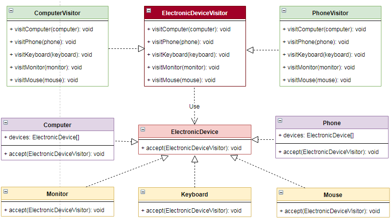

# 访问者 `Visitor`

| :sparkles:模式类型:sparkles::sparkles:|:sparkles::sparkles:难度:sparkles:  :sparkles: | :sparkles::sparkles:实用性:sparkles::sparkles: | :sparkles::sparkles:重要程度:sparkles::sparkles: |  :sparkles::sparkles:经典性:sparkles::sparkles: | :sparkles::sparkles:历史性:sparkles: |
| :----------------------------------------: | :-----------------------------------------------: | :-------------------------------------------------: | :----------------------------------------------------: | :--------------------------------------------------: | :--------------------------------------: |
|                    行为型模式                        |                ★★★ :arrow_down:                 |                  ★★★ :arrow_up:                   |                    ★★★ :arrow_up:                    |              :green_heart:  :arrow_up:               |        :green_heart:  :arrow_up:         |

## 概念
在访问者模式(`Visitor Pattern`)中，使用了一个访问者类，它**改变了元素类的执行算法**。通过这种方式，元素的执行算法**可以随着访问者改变而改变**。这种类型的设计模式属于**行为型模式**。根据模式，元素对象**已接受访问者**对象，这样访问者对象就可以处理元素对象上的操作。

## 用途
主要将**数据结构与数据操作分离**，解决稳定的**数据结构和易变的操作耦合**问题。

## 模式架构
访问者模式是一种将数据操作与数据结构分离的设计模式。

### 参与角色对象
- **`Visitor`：访问者接口或者抽象类**，它定义了对每一个元素（`Element`）**访问的行为**，它的**参数就是可以访问的元素**，它的**方法个数**理论上来讲与**元素个数（`Element`的实现类个数）是一样的**。访问者模式**要求元素的类族要稳定**，如果**经常添加、移除元素**类，必然会导致频繁地修改`Visitor`接口，如果这样则**不适合使用访问者模式**。从这点不难看出，访问者模式要求**元素类的个数不能经常改变**（就是说，**如果元素类的个数经常改变，则说明不适合使用访问者模式**）。
- **`ConcreteVisitor`：具体的访问者**，它需要给出**对每一个元素类访问时**所产生的具体行为。
- **`Element`： 元素接口或者抽象类**，它定义了一个**接受访问者**（`accept`）的方法，其意义是指**每一个元素都要可以被访问者访问**。
- **`ConcreteElement`：具体的元素类**，它提供接**受访问方法的具体实现**，而这个具体的实现，通常情况下是**使用访问者提供的访问该元素类的方法**。
- **`ObjectStructure`：定义当中所提到的对象结构**，对象结构是一个抽象表述，具体点可以**理解为一个具有容器性质或者复合对象特性的类**，它会含有一组元素（`Element`），并且**可以迭代这些元素，供访问者访问**。

### UML关系图

## 优点与缺点
+ **优点**
	 - 符合**单一职责**原则。 
	 - 优秀的**扩展性**。 
	 - **灵活性**。
	
+ **缺点**
	- 具体元素对访问者公布细节，**违反了迪米特**原则。
	- 具体元素**变更比较困难**。 
	- 违反了**依赖倒置原则**，**依赖了具体类**，没有依赖抽象。

## 代码实现
访问者模式的实现要点如下：
+ 定义`Visitor`访问者接口或者抽象类，在接口中定义好访问对应`Element`元素接口或者抽象类的方法接口。
+ 实现或继承`Visitor`访问者接口或者抽象类，实现接口中的方法，可以通过接收到的具体`Element`元素接口或者抽象类完成一部分业务。
+ 定义`Element`角色接口对象，定义一个`accept`的方法接收`Visitor`访问者接口。
+ 定义具体的`Element`角色接口实现类，完成`accept`的方法实现。在具体的`Element`角色接口实现类中完成通过`Visitor`调用对应的`visitXxx`的方法。

### 示例参考
+ [访问者模式](./java/io/github/hooj0/visitor)

## 应用场景
访问者模式适用于：
+ **数据结构稳定**，作用于数据结构的**操作经常变化**的时候。对象结构中对象对应的**类很少改变**，但经常需要在此对象结构上**定义新的操作**。 
+ 需要对一个**对象结构中的对象进行很多不同的并且不相关**的操作，而需要避免让这些操作"**污染**"这些对象的类，也**不希望**在增加新操作时**修改这些类**。
+ 当一个数据结构中，一些**元素类需要负责与其不相关的操作**的时候，为了将这些操作**分离**出去，以**减少**这些元素类的职责时，可以使用访问者模式。
+ 有时在对数据结构上的元素进行操作的时候，需要**区分具体的类型**，这时使用访问者模式可以**针对不同的类型**，在访问者类中定义不同的操作，从而去**除掉类型判断**。

## 应用实例参考

### `JavaSDK` 

- [`Apache Wicket`](https://github.com/apache/wicket) component tree, see [`MarkupContainer`](https://github.com/apache/wicket/blob/b60ec64d0b50a611a9549809c9ab216f0ffa3ae3/wicket-core/src/main/java/org/apache/wicket/MarkupContainer.java)
- [`javax.lang.model.element.AnnotationValue`](http://docs.oracle.com/javase/8/docs/api/javax/lang/model/element/AnnotationValue.html) and [`AnnotationValueVisitor`](http://docs.oracle.com/javase/8/docs/api/javax/lang/model/element/AnnotationValueVisitor.html)
- [`javax.lang.model.element.Element`](http://docs.oracle.com/javase/8/docs/api/javax/lang/model/element/Element.html) and [`Element Visitor`](http://docs.oracle.com/javase/8/docs/api/javax/lang/model/element/ElementVisitor.html)
- [`java.nio.file.FileVisitor`](http://docs.oracle.com/javase/8/docs/api/java/nio/file/FileVisitor.html)

### `GoSDK`

### `PythonSDK`

### `JavaScript Libs`

## 总结