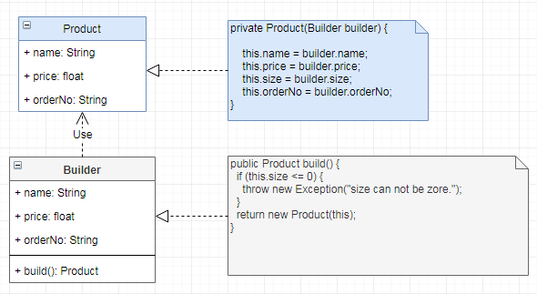

# 建造者 `Builder`

| :sparkles:模式类型:sparkles::sparkles:|:sparkles::sparkles:难度:sparkles:  :sparkles: | :sparkles::sparkles:实用性:sparkles::sparkles: | :sparkles::sparkles:重要程度:sparkles::sparkles: |  :sparkles::sparkles:经典性:sparkles::sparkles: | :sparkles::sparkles:历史性:sparkles: |
| :----------------------------------------: | :-----------------------------------------------: | :-------------------------------------------------: | :----------------------------------------------------: | :--------------------------------------------------: | :--------------------------------------: |
|                 创造型模式                           |                ★★ :arrow_down:                 |                 ★★★★ :arrow_up:                   |                    ★★★★★ :arrow_up:                    |              :green_heart:  :arrow_up:               |        :green_heart:  :arrow_up:         |

## 概念
建造者模式（`Builder Pattern`）将一个**复杂对象的构建（`setter`）与它的表现（`getter`）分离**，使得**同样的构建过程**可以**创建不同**的表示。可以将部件和其组装过程分开，**一步一步创建一个复杂的对象**。用户只需要指定**复杂对象的类型**就可以得到该对象，而**无须知道其内部的具体构造细节**。建造者模式属于**创建型模式**，它提供了一种**创建对象的最佳方式**。一个 `Builder` 类会一步一步构造最终的对象， `Builder` 类是独立于其他对象的。

在软件开发中，也存在**极其复杂**的对象，它们拥有**一系列成员属性**，这些成员属性中有些是引用类型的成员对象。而且在这些复杂对象中，还可能存在一些限制条件，如某些属性没有赋值则复杂对象不能作为一个完整的产品使用；有些属性的赋值必须按照某个顺序，**一个属性没有赋值之前，另一个属性可能无法赋值**等。

## 用途
**建造者模式可以将部件和其组装过程分开，一步一步创建一个复杂的对象。用户只需要指定复杂对象的类型就可以得到该对象，而无须知道其内部的具体构造细节**。

主要解决在软件系统中的“**复杂对象**”的**创建工作**，其通常由**各个部分的子对象**用一定的**算法构成**；由于需求的变化，这个复杂对象的各个部分经常面临着剧烈的变化，但是将它们**组合在一起的算法**却相对稳定。

**复杂对象简单化**：复杂对象相当于一辆有待建造的汽车，而对象的属性相当于汽车的部件，建造产品的过程就相当于组合部件的过程。由于组合部件的过程很复杂，因此，这些部件的组合过程往往被“外部化”到一个称作建造者的对象里，**建造者返还给客户端的是一个已经建造完毕的完整产品对象**，而**用户无须关心该对象所包含的属性以及它们的组装方式**，这就是建造者模式的模式目的。

建造者模式可以**让对象的构造函数变得简单**，也许之前构造函数非常臃肿，并且代码的可读性和可靠性大大降低。为了**简化构造函数**，让构造函数简单，将使用“**反可伸缩构造方法模式**”。

## 模式架构
建造者模式利用**Builder**将构造对象的方法简单化，将部件和其组装过程分开，**一步一步**创建一个复杂的**Product**对象。

**Builder**对象中定义了产品的创建方法和返回方法；**Product**是一个具有**私有构造函数**的对象，**不能通过外部直接实例化**，只能通过**Builder**进行获取。

在客户端代码中，**无须关心产品对象的具体组装过程**，只需确定具体建造者的**类型即可**，建造者模式将复杂对象的构建与对象的**表现分离开来**，这样使得同样的构建过程可以**创建出不同**的表现。

### 参与角色对象
+ **Product**：产品角色，需要描述的产品对象，具有极其复杂的属性或构造参数
+ **Builder**：抽象建造者，将`Product`的构造简单化，利用语法糖的形式进行构建`Product`对象。

### UML关系图

## 优点与缺点
+ **优点**
	- 在建造者模式中，**客户端不必知道产品内部组成的细节**，将产品本身与产品的创建过程解耦，**使得相同的创建过程可以创建不同的产品对象**
	- 每一个具体建造者都相对独立，而与其他的具体建造者无关，因此可以很方便地替换具体建造者或增加新的具体建造者， 用户**使用不同的具体建造者即可得到不同的产品对象**
	- **可以更加精细地控制产品的创建过程**。将复杂产品的创建步骤分解在不同的方法中，使得创建过程更加清晰，也更方便使用程序来控制创建过程。
	- 增加新的具体建造者无须修改原有类库的代码，指挥者类针对抽象建造者类编程，系统扩展方便，符合“开闭原则”。
	- 让对象的构造函数变得简单，并且提高代码的可读性和可靠性
	- 建造者独立，易扩展。便于控制细节风险
	- 可以在构造对象时进行数据校验，在源头杜绝错误的赋值
	
+ **缺点**
	- 建造者模式所创建的产品一般具有较多的共同点，其组成部分相似，如果产品之间的差异性很大，则不适合使用建造者模式，因此其使用范围受到一定的限制。
	- 如果产品的内部变化复杂，可能会导致需要定义很多具体建造者类来实现这种变化，导致系统变得很庞大。
	- 产品必须有共同点，范围有限制。
	- 如内部变化复杂，会有很多的建造类。

## 代码实现

建造者的实现要点如下：
+ 需要定义产品对象，该对象具备无参或有参的私有构造，构造参数接收 `Builder` 对象，不允许外部实例化
+ 提供获取（`getter`）对象实体属性的方法
+ 创建 `Builder` 对象，提供构建 `Builder` 对象的方法，接着提供设置和返回 产品对象的方法
+ 在返回产品对象时，适用于快速失败，在 `build` 时可以做校验，如果不满足必要条件，则可以直接抛出创建异常

### 示例参考
+ [建造者](./java/io/github/hooj0/builder/support)

## 应用场景
+ 需要生成的产品对象有复杂的内部结构，这些产品对象通常包含多个成员属性。
+ 需要生成的产品对象的属性相互依赖，需要指定其生成顺序。
+ 对象的创建过程独立于创建该对象的类。在建造者模式中，将创建过程封装在建造者类中。
+ 隔离复杂对象的创建和使用，并使得相同的创建过程可以创建不同的产品。
+ 当可能存在多种对象并避免构造函数伸缩时。与工厂模式的主要区别在于：当创建是一步过程时，将使用工厂模式，而当创建是多步骤过程时，将使用构建器模式。

## 应用实例参考

### `JavaSDK` 
+ `java.lang.StringBuilder#append()`
+ `java.lang.StringBuffer#append()`
+ `java.sql.PreparedStatement`
+ `javax.swing.GroupLayout.Group#addComponent()`
+ `java.lang.Appendable`

### `GoSDK`

### `PythonSDK`

### `JavaScript Libs`

## 总结
+ 建造者模式将一个**复杂对象的构建（`setter`）与它的表现（`getter`）分离**，使得**同样的构建过程可以创建不同的表示**。建造者模式属于**创建型模式**，它提供了一种**创建对象的最佳方式**。一个 `Builder` 类会**一步一步构造最终**的对象， `Builder` 类是独立于其他对象的。
+ **复杂对象简单化**：建造者模式可以将部件和其组装过程分开，一步一步创建一个复杂的对象。用户只需要指定复杂对象的类型就可以得到该对象，而**无须知道其内部的具体构造细节**。
+ 建造者模式可以**让对象的构造函数变得简单**，也许之前构造函数非常臃肿，并且代码的可读性和可靠性大大降低。为了简化构造函数，让构造函数简单，将使用“**反可伸缩构造方法模式**”。

+ 在建造者模式中，客户端**不必知道产品内部组成的细节**，将产品本身与产品的创建过程**解耦**，使得**相同的创建过程可以创建不同的产品对象**。
+ 可以**更加精细地**控制产品的创建过程。将复杂产品的创建步骤分解在不同的方法中，使得创建过程**更加清晰**，也**更方便使用程序来控制创建过程**。
+ 增加新的具体建造者无须修改原有类库的代码，指挥者类针对抽象建造者类编程，系统扩展方便，符合“**开闭原则**”。
+ **让对象的构造函数变得简单**，并且提高代码的可读性和可靠性
+ 如果产品的**内部变化复杂**，可能会导致需要定义很多具体建造者类来实现这种变化，**导致系统变得很庞大**。

+ 建造者模式适用于：需要生成的产品对象有复杂的内部结构，这些产品对象通常包含**多个成员属性**；需要生成的产品对象的属性相互依赖，需要指定其**生成顺序**；**隔离复杂对象的创建和使用**；当可能存在多种对象并**避免构造函数伸缩**时。

## 参考资料

