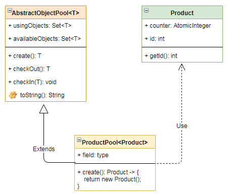

# 对象池 `Object-Pool`

| :sparkles:模式类型:sparkles::sparkles:|:sparkles::sparkles:难度:sparkles:  :sparkles: | :sparkles::sparkles:实用性:sparkles::sparkles: | :sparkles::sparkles:重要程度:sparkles::sparkles: |  :sparkles::sparkles:经典性:sparkles::sparkles: | :sparkles::sparkles:历史性:sparkles: |
| :----------------------------------------: | :-----------------------------------------------: | :-------------------------------------------------: | :----------------------------------------------------: | :--------------------------------------------------: | :--------------------------------------: |
|                   创造型模式                         |                ★★★ :arrow_down:                 |                  ★★★★ :arrow_up:                   |                    ★★★★★ :arrow_up:                    |              :green_heart:  :arrow_up:               |        :green_heart:  :arrow_up:         |

## 概念
对象池模式(`Object-Pool`)实例化并维护一组相同类型的对象实例，方便后续需要使用的时候可以直接在对象池中取。对象池还可以预先缓存一些对象，方便使用时直接使用。这样能大幅度降低资源消耗，提升系统性能。对用完后的对象可以进行回收，提供给其他客户使用。

## 用途
+ 当创建对象很昂贵并且仅在短时间内需要它们时，利用对象池模式是有利的。
+ 对象池为实例化对象提供缓存，以跟踪正在使用哪些对象以及哪些对象可用。
+ 对象池还可以预先缓存一些对象，方便使用时直接使用。这样能大幅度降低资源消耗，提升系统性能。

## 模式架构
对象池充分利用了缓存，将已创建的对象直接提供给客户端使用，使用过的对象进行缓存回收方便下次直接使用。这些对象仅仅在第一次创建的时候消耗资源，后续可以直接从缓存取来使用。对象池中的方法要保证在多线程并发下是线程安全的。

### 参与角色对象
+ **AbstractObjectPool**：对象池抽象类，提供对象池对象的创建、获取、缓存方法
+ **ProductPool**：具体产品对象池，继承`AbstractObjectPool`，实现`create`方法提供产品的创建实例
+ **Product**：具体产品对象，是`ProductPool`对象池的泛型对象

### UML关系图

## 优点与缺点
+ **优点**
	+ 对象池还可以预先缓存一些对象，方便使用时直接使用。这样能大幅度降低资源消耗，提升系统性能。
	+ 对用完后的对象可以进行回收，提供给其他客户使用。
	+ 对象池实现是线程安全的，可以提供并发。
	
+ **缺点**
	+ 由于保证线程安全，可以在一定程度上又损耗了一部分性能。
	+ 回收对象需要手动进行放置回收。
	
## 代码实现

对象池模式的实现要点如下：
+ 需要定义对象池接口或抽象类`AbstractObjectPool`，定制创建产品的功能方法`create()`、获取对象实例的方法`checkOut()`、回收对象实例的方法`checkIn()`
+ 需要定义具体的产品对象`Product`，这个对象是对象池的泛型对象
+ 定义具体产品对象的对象池`ProductPool`，继承`AbstractObjectPool`，实现`create`方法提供产品的创建实例
+ 对象池要保持线程安全性

### 示例参考
+ [对象池模式](./java/io/github/hooj0/objectpool/)

## 应用场景
使用对象池模式时：
+ 对象的创建成本很高（分配成本）
+ 你需要大量的短期对象（内存碎片）
+ 对象的复用性高

## 应用实例参考

### `JavaSDK` 

### `GoSDK`

### `PythonSDK`

### `JavaScript Libs`

## 总结
+ 实例化并维护一组相同类型的对象实例，方便后续需要使用的时候可以直接在对象池中取。
+ 对象池还可以预先缓存一些对象，方便使用时直接使用。对用完后的对象可以进行回收，提供给其他客户使用。这样能大幅度降低资源消耗，提升系统性能。
+ 当创建对象很昂贵并且仅在短时间内需要它们时，利用对象池模式是有利的。
+ 对象池为实例化对象提供缓存，以跟踪正在使用哪些对象以及哪些对象可用。
+ 由于保证线程安全，可以在一定程度上又损耗了一部分性能。
+ 使用对象池模式适用于：对象的创建成本很高（分配成本），需要大量的短期对象（内存碎片）

## 参考资料

