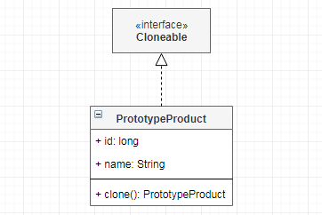

# 原型 `Prototype`

| :sparkles:模式类型:sparkles::sparkles:|:sparkles::sparkles:难度:sparkles:  :sparkles: | :sparkles::sparkles:实用性:sparkles::sparkles: | :sparkles::sparkles:重要程度:sparkles::sparkles: |  :sparkles::sparkles:经典性:sparkles::sparkles: | :sparkles::sparkles:历史性:sparkles: |
| :----------------------------------------: | :-----------------------------------------------: | :-------------------------------------------------: | :----------------------------------------------------: | :--------------------------------------------------: | :--------------------------------------: |
|                创造型模式                            |                ★ :arrow_down:                 |                  ★★★ :arrow_up:                   |                    ★★★★★ :arrow_up:                    |              :green_heart:  :arrow_up:               |        :green_heart:  :arrow_up:         |

## 概念
原型模式（`Prototype Pattern`）是用于**创建重复**的对象，同时又能**保证性能**。原型模式虽然是创建型的模式，但是与工厂模式没有关系，从名字即可看出，该模式的思想就是**将一个对象作为原型，对其进行复制、克隆**，产生一个和原对象类似的**新对象**。使得类的实例能够生成**自身的拷贝**。

如果创建一个对象的实例**非常复杂且耗时**时，就可以使用这种模式，而**不重新创建一个新的实例**，你可以拷贝一个对象并在**原始对象副本数据的基础上修改它**。

## 用途
使用原型实例指定要创建的对象类型，并通过**复制此原型来创建新对象**。这种模式是实现了一个**原型接口**，该接口用于创建**当前对象的克隆**。它允许您创建现有对象的**副本**并根据需要进行**修改**，而不是从头开始创建对象并进行设置。

当直接创建对象的**代价比较大**时，则采用这种模式。例如，一个对象需要在一个高代价的数据库操作之后被创建。我们可以缓存该对象，在下一个请求时返回它的**克隆**，在需要的时候更新数据库，以此来**减少数据库调用**。

## 模式架构
原型模式的核心就是在**已经提供的对象的基础上**来构造一个新的对象，它允许**创建现有对象的副本并根据需要进行修改**，而不是从头开始创建对象并进行设置。在构建原型模式的对象时，只需要**实现自我复制**的功能即可。

结合对象的**浅复制和深复制**来说一下，首先需要了解对象深、浅复制的概念：
+ **浅复制**：将一个对象复制后，基本数据类型的变量都会重新创建，而**引用类型**，指向的还是**原对象所指向**的。
+ **深复制**：将一个对象复制后，不论是基本数据类型还有引用类型，都是**重新创建**的。简单来说，就是深复制进行了**完全彻底的复制**，而浅复制不彻底。

### 参与角色对象
+ **`Cloneable` 克隆接口或抽象类**：定义克隆方法`clone`，所有子类或实现类实现其方法返回克隆对象。
+ **`Product` 具体产品**：需要实现 `Cloneable` 接口，并并覆盖 `clone` 方法。在 `clone` 方法中返回对象实例，提供需要的数据。

### UML关系图

## 优点与缺点
+ **优点**
	- **直接创建对象的代价比较大**，利用原型模式会**节约系统资源和提高性能**
	- **避免构造函数的约束**
	- 创建**相同（克隆）的对象**变得异常简单
	
+ **缺点**
	- 配备克隆方法需要对类的功能进行通盘考虑，这对于全新的类不是很难，但对于已有的类不一定很容易，特别当一个类**引用不支持串行化**的间接对象，或者引用含有**循环结构**的时候。
	- 必须**实现 `Cloneable` 接**口。
	- 对象克隆的对象，如果对象**属性较多，克隆的时候也非常繁琐**。

## 代码实现
原型模式的实现要点如下：
+ 需要实现 `Cloneable` 接口，并覆盖 `clone` 方法。
+ 在 `clone` 方法中返回对象实例，调用父类的 `clone`方法，并 提供需要的数据。`super.clone()`调用的是`Object`的`clone()`方法，而在`Object`类中，`clone()`是`native`的。

### 示例参考
+ [原型模式](./java/io/github/hooj0/prototype/)

## 应用场景
原型模式的核心就是在已经提供的对象的基础上来构造一个新的对象，所以以下场景适用原型模式：

+ 当一个**系统应该独立于**它的产品创建，构成和表示时。
+ 当系统应独立于其产品的**创建、组合和表示**方式时。
+ 当要在运行时指定要**实例化的类**时，例如，通过动态加载。
+ 避免构建与产品类层次结构相似的工厂类层次结构。
+ 当一个类的实例可以只有**几个不同的状态组合之一**。创建相应数量的原型并克隆它们可能更方便，而**不是手动实例化类**，每次都有适当的状态。
+ 同一个对象，需要**创建大量重复的创建**。与克隆相比，对象创建成本高昂。使用原型模式进行克隆对象可以快速并降低资源。
+ 资源优化，类初始化需要**消化非常多的资源**，这个资源包括数据、硬件资源等。 
+ **性能和安全要求的场景**，通过 `new` 产生一个对象需要非常繁琐的数据准备或访问权限，则可以使用原型模式。
+ 一个对象**多个修改者**的场景，一个对象需要提供给其他对象访问，而且各个调用者可能都需要修改其值时，可以考虑使用原型模式拷贝多个对象供调用者使用。 
+ 在实际项目中，原型模式很少单独出现，**一般是和工厂方法模式一起出现，通过 `clone` 的方法创建一个对象**，然后由工厂方法提供给调用者。原型模式已经与 `Java` 融为浑然一体，大家可以随手拿来使用。 

## 应用实例参考

### `JavaSDK` 
+ `java.lang.Object#clone()`
+ `java.lang.Cloneable`

### `GoSDK`

### `PythonSDK`

### `JavaScript Libs`

## 总结
+ 用于**创建重复**的对象，同时又能**保证性能**。从名字即可看出，该模式的思想就是将一个对象作为原型，对其进行**复制、克隆**，产生一个和原对象类似的新对象。使得类的实例能够**生成自身**的拷贝。
+ 如果创建一个对象的实例**非常复杂且耗时**时，就可以使用这种模式，而不重新创建一个新的实例，你可以拷贝一个对象并在原始对象**副本数据的基础上修改**它。
+ 原型模式的核心就是在**已经提供的对象的基础上**来构造一个新的对象，它允许您创建现有对象的副本并根据需要进行修改，而不是从头开始创建对象并进行设置。在构建原型模式的对象时，只需要实现**自我复制**的功能即可。
+ 直接创建对象的代价比较大，利用**原型模式会节约系统资源和提高性能**。
+ 同一个对象，需要创建**大量重复**的创建。与克隆相比，对象创建**成本高昂**。使用原型模式进行克隆对象可以**快速并降低资源**。
+ 一个对象**多个修改者**的场景，一个对象需要提供给其他对象访问，而且各个调用者可能都需要修改其值时，可以考虑使用原型模式拷贝多个对象供调用者使用。

