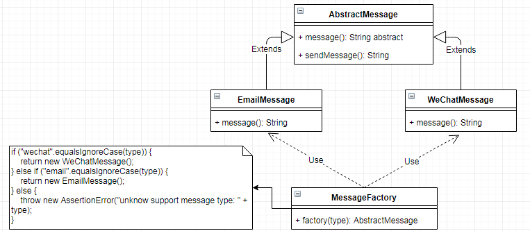

# 简单工厂 `SimpleFactory`

| :sparkles:模式类型:sparkles::sparkles:|:sparkles::sparkles:难度:sparkles:  :sparkles: | :sparkles::sparkles:实用性:sparkles::sparkles: | :sparkles::sparkles:重要程度:sparkles::sparkles: |  :sparkles::sparkles:经典性:sparkles::sparkles: | :sparkles::sparkles:历史性:sparkles: |
| :----------------------------------------: | :-----------------------------------------------: | :-------------------------------------------------: | :----------------------------------------------------: | :--------------------------------------------------: | :--------------------------------------: |
|                   创造型                         |                ★★ :arrow_down:                 |                  ★★★★ :arrow_up:                   |                    ★★★★ :arrow_up:                    |              :green_heart:  :arrow_up:               |        :green_heart:  :arrow_up:         |

## 概念
简单工厂模式(`Simple Factory Pattern`)： 又称为静态工厂方法(`Static Factory Method`)模式，它属于类创建型模式。 在简单工厂模式中，可以根据参数的不同返回不同类的实例。 简单工厂模式专门定义一个类来负责创建其他类的实例，被创建的实例通常都具有共同的父类或接口。简单工厂一般分为：普通简单工厂、多方法简单工厂、静态方法简单工厂。

## 用途
在创建一个对象时不向客户暴露内部细节，并提供一个创建对象的通用接口或抽象类实现。使用者只需用工厂创建需要使用接口或抽象类中的方法即可完成需要的业务调用。

## 模式架构
简单工厂模式架构分为三个部分：第一部分需要定义工厂生产的产品的统一规范，这个规范就是我们需要的产品的具体接口；第二部分需要定义一个产品的真实物理形态，这个就是产品的具体功能实现；第三是需要提供一个工厂，可以大批量的快捷简单的、在客户不需要知道具体生成逻辑业务的情况下生成产品。

### 参与角色对象
+ **`Factory` 工厂类**：提供生产不同的产品实例对象，将生产产品的业务逻辑封装在工厂类而不对外暴露
+ **`AbstractProduct` 产品接口或抽象类**：提供统一的产品定制模型，定制一套规范规格化的产品
+ **`XxxProduct` 产品类**：提供构建不同的产品对象

### UML关系图

## 优点与缺点
+ **优点**
  - 提供统一的产品规范规格，如需要产品实现产品接口或抽象类即可
  - 工厂类提供统一生产产品的方法，方便简单的生产客户需要的产品
  - 工厂生产产品业务不对外透明，降低了耦合性，客户端可以免除直接创建产品对象的责任，将责任进行分割
  - 客户端消费产品无需知道具体的实现或类名，只需用提供产品的类型或规格参数即可获取对应的产品
  - 在大规模的集成情况下，可以在客户端提供一个配置，修改配置获取不同的产品，有利于动态修改客户端产品需求
+ **缺点**
  - 有用工厂不对外暴露细节不公开透明，当产品工厂出现豆腐渣工程问题将导致整个产品线都不能正常运行
  - 系统扩展困难，由于提供统一的产品接口或抽象类，改变接口需要修改所有产品实现类
  - 在产品较多的情况下，业务复杂不利于维护，由于产品工厂提供构建产品实例，业务逻辑都在工厂中实现，一旦添加新产品都需要修改产品工厂
  - 简单工厂模式由于使用了静态工厂方法，造成工厂角色无法形成基于继承的等级结构

## 代码实现
在实现简单工厂方法时，需要注意一下几点：
- 定义统一规格规范的产品接口或抽象类
- 实现产品接口或抽象类
- 工厂方法产生的产品需要有统一的继续产品父类或接口实现
- 向客户端提供统一的创建工厂实例方法
- 不向客户端提供工厂创建实例实现的相关细节或业务、不暴露内部细节
- 工厂类提供通过工厂生成产品的统一方法

### 示例参考
+ [普通简单工厂](./java/io/github/hooj0/simplefactory/support/_static)
+ [多方法简单工厂](./java/io/github/hooj0/simplefactory/support/more)
+ [静态方法简单工厂](./java/io/github/hooj0/simplefactory/support/single)

## 应用场景
在以下情况下可以使用简单工厂模式：
工厂类负责创建的对象比较少：由于创建的对象较少，不会造成工厂方法中的业务逻辑太过复杂。
客户端只知道传入工厂类的参数，对于如何创建对象不关心：客户端既不需要关心创建细节，甚至连类名都不需要记住，只需要知道类型所对应的参数。

## 应用实例参考

### `JavaSDK` 
+ `java.text.DateFormat`
	- `public final static DateFormat getDateInstance();`
	- `public final static DateFormat getDateInstance(int style);`
	- `public final static DateFormat getDateInstance(int style, Locale locale);`
+ `KeyGenerator.getInstance("DESede")`
+ `Cipher.getInstance("DESede")`
	
### `GoSDK`

### `PythonSDK`

### `JavaScript Libs`

## 总结
总体来说，工厂模式适合：凡是出现了大量的产品需要创建，并且具有共同的接口时，可以通过工厂方法模式进行创建。在以上的三种模式中，第一种如果传入的字符串有误，不能正确创建对象，第三种相对于第二种，不需要实例化工厂类，所以，大多数情况下，我们会选用第三种——静态工厂方法模式。

简单工厂属于创造型模式，对类的实例化过程进行了抽象和封装，将对象的创建和使用过程进行分类。

简单工厂模式又称为静态工厂模式，可以在工厂类上通过不同的参数返回特定的实例对象，简单工厂所实例化的类都有一个共同的接口或父类。

简单工厂的要点在于你需要什么对象，只需用传入和这个对象有关的参数即可，无需知道内部实现细节。

简单工厂的最大优点是将对象的创建和对象的使用进行分离，将对象的创建交给工厂类负责；但是缺点就是工厂类不够灵活，每当需要增加新的产品类都需要修改工厂类的业务逻辑，而且在产品较多的情况下，工厂类的代码将变得复杂。

简单工厂模式适用情况包括：工厂类负责创建的对象比较少；客户端只知道传入工厂类的参数，对于如何创建对象不关心。

## 参考资料
pass

