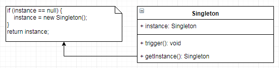

# 单例 `Singleton`

| ✨模式类型✨✨ | ✨✨难度✨  ✨ | ✨✨实用性✨✨ | ✨✨重要程度✨✨ | ✨✨经典性✨✨ | ✨✨历史性✨ |
| :---------: | :--------: | :--------: | :----------: | :--------: | :-------: |
|   创造型    |    ★★ ⬇️    |  ★★★★★ ⬆️   |   ★★★★★ ⬆️    |  💚💚💚💚💚  ⬆️  | 💚💚💚💚💚  ⬆️  |

## 概念

单例模式(`Singleton`)，一种**创造型模式**，它提供了创建对象的**唯一实例的一种标准方式**。单例模式实现类一般就是**一个**，主要就是**本身自己**，它为自己提供一种实例化的方法，并确保实例化对象**限制为一个全局唯一**的对象。调用者直接从**对象本身获取实例，而不需要创建实例**。

## 用途

如果一个**全局使用的类被频繁构建或销毁**，而又想为系统**节约资源开销**，可以使用单例模式。单例保证一个类**仅有一个实例**，并提供一个**创建或访问单例对象的全局唯一点**。 这样单例对象就不会被频繁的构建和销毁，**节省资源开销**。

## 特点

+ **简单易掌握、实用性强**，属于经典的模式之一，出现的年代久远
+ 创造型设计模式，用于**构建（创建）对象实例**
+ **全局唯一实例，不存在重复**（在一定程度上，并发下有重复实例情况）
+ 单例类必须**自己创建自己的唯一实例**
+ 单例类必须给所有其他对象**提供自己的实例** 
+ 节省资源开**销，仅仅构建一次可以**重复使用**
+ 单例的类其构造函数一般是**私有类型，不允许外部进行实例化**

## 优点与缺点

+ **优点**
  + 节省资源，内存仅有一个对象，**全局唯一实例**
  + **共享唯一实例**，提供了对唯一实例的**受控访问**，使用方便。
  
+ **缺点**
  + **紧耦合，不能继承、不能扩展**
  + 不能存在单例的**子类**
  + 通过**控制自己的创建和生命周期违反单一责任原则**（`SRP`） 。单例类的**职责过重**，在一定程度上**违背了“单一职责原则”**。因为单例类既充当了工厂角色，提供了工厂方法，同时又充当了产品角色，包含一些业务方法，将产品的创建和产品的本身的功能融合到一起
  + **滥用单例将带来一些负面问题**，如为了节省资源将数据库连接池对象设计为单例类，可能会导致共享连接池对象的程序过多而出现连接池溢出

## 模式架构

单例模式的目的是**保证一个类仅有一个实例**，并提供一个访问它的**全局访问点**。单例模式包含的**角色只有一个**，就是单例类——`Singleton`。单例类拥有一个**私有构造函数**，确保用户无法通过`new`关键字直接实例化它。除此之外，该模式中包含一个**静态私有成员变量与静态公有的工厂方法**，该工厂方法负责**检验实例的存在性并实例化自己**，然后存储在静态成员变量中，以确保只有一个实例被创建。

### 参与角色对象

+ **使用者**：需要使用单例实例的对象
+ **`Singleton` 提供者**：单例对象类本身

### UML关系图

## 代码实现

在单例模式的实现过程中，需要注意如下三点：

- 单例类的构造函数为**私有**；
- 提供一个自身的**静态私有成员变量**；
- 提供一个**公有的静态工厂方法**。

### 示例参考
+ [懒汉式，线程不安全](./java/io/github/hooj0/singleton/support/lazy_thread_unsafe/LazyThreadUnsafeSingleton.java)
+ [懒汉式，线程安全](./java/io/github/hooj0/singleton/support/lazy_thread_safe/LazyThreadSafeSingleton.java)
+ [饿汉式](./java/io/github/hooj0/singleton/support/hungry_thread_safe/HungryThreadSafeSingleton.java)
+ [双检锁/双重校验锁](./java/io/github/hooj0/singleton/support/double_checked_locking/DCLSingleton.java)
+ [静态内部类](./java/io/github/hooj0/singleton/support/static_inner_class/StaticInnerClassSingleton.java)
+ [枚举](./java/io/github/hooj0/singleton/support/enum_class/EnumSingleton.java)

## 应用场景

+ 在系统中一些对象**只需用一个实例**，而**不需要多个实例对象**的情况下就适合使用单例模式。
+ 某些**对象对资源消耗大**，**不允许重复创建相同实例**对象，为节省资源，应该使用单例模式。
+ 某些服务**只提供一个唯一的访问入口**，可以使用单例对客户端访问进行统一管理，提供一个唯一的单例客户端实例。
+ 如系统中的日志实例对象，一个系统**只需用一个日志写入实例**，提供统一的日志写入实现。这样很好的规范了日志的写入格式和文件位置等。
+ 系统的**文件管理器**，提供唯一实例管理系统文件。
+ **`ID`生成器，生成唯一全局的`ID`**，这种服务唯一的服务入口生成`ID`。

## 应用实例参考

### `JavaSDK`

- [`java.lang.Runtime#getRuntime()`](http://docs.oracle.com/javase/8/docs/api/java/lang/Runtime.html#getRuntime%28%29)
- [`java.awt.Desktop#getDesktop()`](http://docs.oracle.com/javase/8/docs/api/java/awt/Desktop.html#getDesktop--)
- [`java.lang.System#getSecurityManager()`](http://docs.oracle.com/javase/8/docs/api/java/lang/System.html#getSecurityManager--)

### `GoSDK`

### `PythonSDK`

### `JavaScript Libs`

## 总结
+ 一般情况下，**不建议**使用第 1 种和第 2 种懒汉方式，**建议使用第 3 种饿汉方式**。
+ 只有在要**明确实现 `lazy loading` 效果时**，才会使用第 5 种登记方式。
+ 如果涉及到**反序列化**创建对象时，可以尝试使用第 6 种枚举方式。
+ 如果有其他**特殊的需求**，可以考虑使用第 4 种双检锁方式。

## 参考资料

