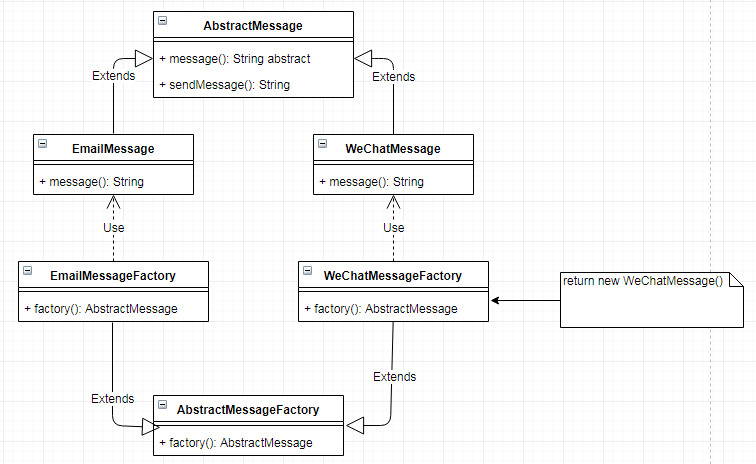

# 工厂方法 `Factory Method`

| :sparkles:模式类型:sparkles::sparkles:|:sparkles::sparkles:难度:sparkles:  :sparkles: | :sparkles::sparkles:实用性:sparkles::sparkles: | :sparkles::sparkles:重要程度:sparkles::sparkles: |  :sparkles::sparkles:经典性:sparkles::sparkles: | :sparkles::sparkles:历史性:sparkles: |
| :----------------------------------------: | :-----------------------------------------------: | :-------------------------------------------------: | :----------------------------------------------------: | :--------------------------------------------------: | :--------------------------------------: |
|          创造型                                  |                ★★ :arrow_down:                 |                  ★★★★ :arrow_up:                   |                    ★★★★★ :arrow_up:                    |              :green_heart:  :arrow_up:               |        :green_heart:  :arrow_up:         |

## 概念
工厂方法模式(`Factory Method Pattern`)又称为工厂模式，也叫虚拟构造器(`Virtual Constructor`)模式或者多态工厂(`Polymorphic Factory`)模式，它属于类创建型模式。在工厂方法模式中，工厂父类负责定义创建产品对象的公共接口，而工厂子类则负责生成具体的产品对象，这样做的目的是**将产品类的实例化操作延迟到工厂子类中完成**，即通过工厂子类来确定究竟应该实例化哪一个具体产品类。

## 用途
在简单工厂模式中，当添加新产品的时候，都需要修改工厂类的业务逻辑，提供创建新产品的业务。在产品过多的情况下，这种方式非常复杂或繁琐，并且容易出错导致维护、扩展极其复杂。这个时候如果使用工厂方法模式，将实例化产品的方法推迟到子类中完成，这将工厂的业务分离到子类从而变得简单且易于维护。

## 模式架构
工厂方法承接简单工厂模式，在工厂类这一层进行了分解，将所有构建产品的工厂分解成不同产品的工厂让子类工厂进行业务封装实现，这样就解决了所有创建产品的业务聚集在一个类中的情况，避免了业务复杂性。

### 参与角色对象
工厂方法模式包含如下角色：
+ **Product**：抽象产品、产品接口，提供统一的产品定制模型，定制一套规范规格化的产品
+ **ConcreteProduct**：具体产品，提供构建不同的产品对象
+ **Factory**：抽象工厂，提供生产不同的产品实例的抽象类
+ **ConcreteFactory**：具体工厂，继承抽象工厂类，将生产产品的业务逻辑封装在工厂类而不对外暴露

### UML关系图

## 优点与缺点
+ **优点**
	- 利用工厂方法的工厂子类将实例化创建产品实例对象的过程进行封装隐藏，对外不公开创建对象的业务逻辑，客户端只需用使用具体产品工厂即可创建实例，而无需知道内部流程或细节
	- 工厂方法利用了抽象类特性，充分使用了语言的多态性，这个是工厂方法模式的关键。工厂子类可以自主的创建产品，并且将细节业务封装在子类内部。这就是工厂方法也叫多态工厂的原因。
	- 工厂方法在新增产品的时候，不需要再修改工厂类（无须修改抽象工厂和抽象产品提供的接口，无须修改客户端，也无须修改其他的具体工厂和具体产品），而是创建一个新的产品工厂子类，实现产品实例化的方法即可。这样将各个产品实例化的业务逻辑专业到工厂产品子类中，降低了复杂性，维护也变得简单。
	- 工厂方法的可扩展性好、易于维护，完全符合“开闭原则”。
+ **缺点**
	- 工厂方法在新增产品的时候，需要创建一个新的产品工厂子类，并实现产品实例化的方法，这样导致每次添加产品会变得复杂。当产品过多，工厂类也变多，导致系统文件庞大且编译慢。
	- 由于考虑到系统的可扩展性，需要引入抽象层，在客户端代码中均使用抽象层进行定义，增加了系统的抽象性和理解难度，且在实现时可能需要用到DOM、反射等技术，增加了系统的实现难度。

## 代码实现
工厂方法的实现要点如下：
+ 需要定义产品接口或抽象类，定制需要实现的方法功能
+ 每个具体的产品需要实现产品接口或抽象类，完成方法功能的实现
+ 工厂类是一个抽象类，定义工厂方法的具体对象，定义构造产品的工厂方法
+ 工厂产品子类需要继承工厂类，完成工厂产品的创建（工厂产品的实例化）

### 示例参考
+ [工厂方法](./java/io/github/hooj0/factorymethod/support/)

## 应用场景
以下情况适用工厂方法模式：
+ 不确定具体有多少个产品实现类，只需知道产品实现具体的产品接口和产品工厂类即可。
+ 一个类不知道产品实例对应的类名，但只需知道对应的产品类工厂即可。
+ 一个产品工厂通过指定子类作为实例化产品的工厂类，在工厂方法模式中，对于抽象工厂类只需要提供一个创建产品的接口，而由其子类来确定具体要创建的对象，利用面向对象的多态性和里氏代换原则，在程序运行时，子类对象将覆盖父类对象，从而使得系统更容易扩展。
+ 客户端只知道传入工厂类的参数，对于如何创建对象不关心：客户端既不需要关心创建细节，甚至连类名都不需要记住，只需要知道类型所对应的参数。

## 应用实例参考

### `JavaSDK` 
+ java.lang.Proxy#newProxyInstance()
+ java.lang.Object#toString()
+ java.lang.Class#newInstance()
+ java.lang.reflect.Array#newInstance()
+ java.lang.reflect.Constructor#newInstance()
+ java.lang.Boolean#valueOf(String)
+ java.lang.Class#forName()

+ java.util.Calendar
+ java.util.ResourceBundle
+ java.text.NumberFormat
+ java.nio.charset.Charset
+ java.net.URLStreamHandlerFactory
+ java.util.EnumSet
+ javax.xml.bind.JAXBContext

### `GoSDK`

### `PythonSDK`

### `JavaScript Libs`

## 总结
+ 工厂方法模式又称为**工厂模式**，它属于类**创建型模式**。在工厂方法模式中，**工厂父类**负责定义创建产品对象的**公共接口**，而**工厂子类**则负责**生成具体的产品**对象，这样做的目的是将**产品类的实例化操作延迟到工厂子类中完成**，即通过工厂子类来确定究竟应该实例化哪一个具体产品类。
+ 工厂方法模式包含四个角色：**抽象产品**是定义产品的接口，是工厂方法模式所创建对象的**超类型**，即**产品对象的共同父类或接口**；具体产品**实现了抽象产品接口**，某种类型的具体产品由**专门的具体工厂**创建，它们之间往往一一对应；抽象工厂中声明了**工厂方法**，用于返回一个产品，它是工厂方法模式的核心，任何在模式中创建对象的工厂类都**必须实现**该接口；具体工厂是**抽象工厂类的子类**，实现了抽象工厂中定义的工厂方法，并可由客户调用，返回一个具体产品类的实例。
+ 工厂方法模式是简单工厂模式的进一步抽象和推广。由于使用了面向对象的**多态性**，工厂方法模式保持了简单工厂模式的优点，而且克服了它的缺点。在工厂方法模式中，**核心的工厂类不再负责所有产品的创建**，而是将具体创建工作**交给子类**去做。这个核心类仅仅负责给出具体工厂必须实现的接口，而**不负责产品类被实例化这种细节**，这使得工厂方法模式可以允许系统在**不修改**工厂角色的情况下引进新产品。
+ 工厂方法模式的主要优点是**增加新的产品类时无须修改现有系统**，并封装了产品对象的创建细节，系统具有良好的**灵活性和可扩展性**；其缺点在于增加新产品的同时需要增加新的工厂，导致系统类的个数成对增加，在一定程度上增加了系统的**复杂性**。
+ 工厂方法模式适用情况包括：一个类不知道它所需要的对象的类；一个类通过其子类来指定创建哪个对象；将创建对象的任务委托给多个工厂子类中的某一个，客户端在使用时可以无须关心是哪一个工厂子类创建产品子类，需要时再动态指定。

## 参考资料

