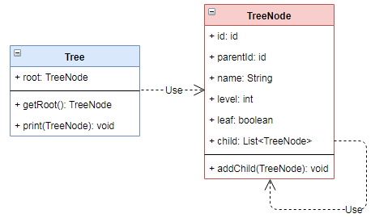

# 组合 `Composite`

| :sparkles:模式类型:sparkles::sparkles:|:sparkles::sparkles:难度:sparkles:  :sparkles: | :sparkles::sparkles:实用性:sparkles::sparkles: | :sparkles::sparkles:重要程度:sparkles::sparkles: |  :sparkles::sparkles:经典性:sparkles::sparkles: | :sparkles::sparkles:历史性:sparkles: |
| :----------------------------------------: | :-----------------------------------------------: | :-------------------------------------------------: | :----------------------------------------------------: | :--------------------------------------------------: | :--------------------------------------: |
|                 结构型模式             |                ★★★ :arrow_down:                 |                  ★★★★ :arrow_up:                   |                    ★★★★★ :arrow_up:                    |              :green_heart:  :arrow_up:               |        :green_heart:  :arrow_up:         |

## 概念
组合模式（`Composite Pattern`），又叫**部分整体模式**，是用于把一组**相似的对象当作一个单一的对象**。组合模式依据**树形结构**来组合对象，用来表示部分以及整体层次。这种类型的设计模式属于结构型模式，它创建了**对象组的树形结构**。

## 用途
使得客户端看来单个对象和对象的组合是同等的。换句话说，某个类型的方法同时也接受自身类型作为参数。将对象组合成树形结构以表示**部分-整体**的层次结构。组合模式使得用户对**单个对象和组合对象**的使用具有一致性。它在我们树型结构的问题中，模糊了简单元素和复杂元素的概念，客户程序可以向处理简单元素一样来处理复杂元素，从而**使得客户程序与复杂元素的内部结构解耦**。

## 模式架构
组合模式对象可以进行反复或重复组合拼接，最终组合出无数个不同的对象体。组合对象可以进行自引用，即一个相同的对象类型进行自关联。

### 参与角色对象
+ **Component**：一个组件对象，里面可以包括其他各种不同的组件，但这些组件都是继承当前组件类的组件。

### UML关系图

## 优点与缺点
+ **优点**
	- 高层模块调用简单。 
	- 节点自由增加。
	- 模块结构简单明确。
	- 对象进行大量组合，提供代码可复用行，减少冗余的代码
	
+ **缺点**
	- 在使用组合模式时，其叶子和树枝的声明都是实现类，而不是接口，违反了依赖倒置原则。

## 代码实现

组合模式的实现要点如下：
+ 定义组合对象 `TreeNode`，在对象本身中添加该对象的引用，让对象可以进行自引用
+ 定义`Tree`包装对象 `TreeNode`对象，相当于在树形的根元素中存在无数个子节点

### 示例参考
+ [组合模式](./java/io/github/hooj0/composite/)

## 应用场景
组合模式适用于：
+ 想要表示对象的部分整体层次结构
+ 希望客户能够忽略对象和单个对象的组合之间的差异。客户端将统一处理复合结构中的所有对象

## 应用实例参考

### `JavaSDK` 
+ `javax.swing.JComponent#add(Component)`
+ `java.awt.Container#add(Component)`
+ `java.util.Map#putAll(Map)`
+ `java.util.List#addAll(Collection)`
+ `java.util.Set#addAll(Collection)`

### `GoSDK`

### `PythonSDK`

### `JavaScript Libs`

## 总结
+ 组合模式是用于把一组相似的对象当作一个单一的对象。组合模式依据树形结构来组合对象，用来表示部分以及整体层次。这种类型的设计模式属于结构型模式，它创建了对象组的树形结构。
+ 使得客户端看来单个对象和对象的组合是同等的。换句话说，某个类型的方法同时也接受自身类型作为参数。组合模式使得用户对单个对象和组合对象的使用具有一致性。
+ 组合模式对象可以进行反复或重复组合拼接，最终组合出无数个不同的对象体。组合对象可以进行自引用，即一个相同的对象类型进行自关联。
+ 高层模块调用简单，节点自由增加，模块结构简单明确。
+ 组合模式适用于：想要表示对象的部分整体层次结构；希望客户能够忽略对象和单个对象的组合之间的差异，客户端将统一处理复合结构中的所有对象。

## 参考资料

