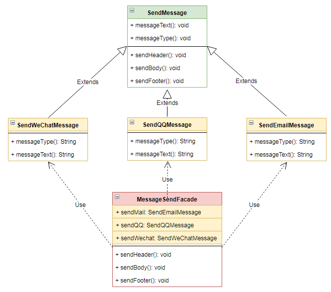

# 外观 `Facade`

| :sparkles:模式类型:sparkles::sparkles:|:sparkles::sparkles:难度:sparkles:  :sparkles: | :sparkles::sparkles:实用性:sparkles::sparkles: | :sparkles::sparkles:重要程度:sparkles::sparkles: |  :sparkles::sparkles:经典性:sparkles::sparkles: | :sparkles::sparkles:历史性:sparkles: |
| :----------------------------------------: | :-----------------------------------------------: | :-------------------------------------------------: | :----------------------------------------------------: | :--------------------------------------------------: | :--------------------------------------: |
|                 结构型模式                           |                ★★★ :arrow_down:                 |                  ★★★★ :arrow_up:                   |                    ★★★★ :arrow_up:                    |              :green_heart:  :arrow_up:               |        :green_heart:  :arrow_up:         |

## 概念
外观模式(`Facade Pattern`)：外部与一个子系统的通信必须通过一个**统一的外观对象**进行，为子系统中的一组接口提供一个**一致的界面**，外观模式定义了一个高层接口，这个接口使得这一**子系统更加容易使用**。外观模式又称为**门面模式**，它是一种对象结构型模式。外观模式**隐藏系统的复杂性**，并向客户端提供了一个客户端可以访问系统的接口。这种模式涉及到一个单一的类，该类提供了**客户端请求的简化方法**和对现有系统类方法的**委托调用**。

## 用途
外观模式为子系统中的一组接口提供**统一接口**。外观模式定义了一个**更高级别的接口，使子系统更易于使用**。简单来说，外观模式为**复杂的子系统提供了简化的界面**。降低访问复杂系统的内部子系统时的**复杂度，简化客户端与之的接口**。

## 模式架构
根据“**单一职责原则**”，在软件中将一个系统划**分为若干个子系统**有利于**降低整个系统的复杂性**，一个常见的设计目标是使子系统间的**通信和相互依赖关系达到最小**，而达到该目标的途径之一就是引入一个外观对象，它为子系统的访问提供了一个**简单而单一的入口**。 
- 外观模式的目的在于**降低系统的复杂程度**。外观模式也是“迪米特法则”的体现，通过引入一个新的外观类可以**降低原有系统的复杂度**，同时降低客户类与子系统类的**耦合度**。
- 外观模式要求一个子系统的外部与其内部的**通信通过一个统一的外观对象进行**，外观类将客户端与子系统的内部复杂性分隔开，使得**客户端只需要与外观对象打交道**，而不需要与子系统内部的很多对象打交道。 
- 外观模式从很大程度上提高了客户端使用的**便捷性**，使得客户端**无须关心子系统的工作细节**，通过外观角色即可调用相关功能。

## 模式扩展
+ **一个系统有多个外观类**：
在外观模式中，通常只需要**一个外观类**，并且此外观类**只有一个实例**，换言之它是一个**单例类**。在很多情况下为了节约系统资源，一般将外观类设计为单例类。当然这**并不意味着在整个系统里只能有一个外观类**，在一个系统中可以设计多个外观类，**每个外观类都负责和一些特定的子系统交互**，向用户提供相应的业务功能。
+ **不要试图通过外观类为子系统增加新行为**：
不要通过继承一个外观类在子系统中加入新的行为，这种做法是错误的。外观模式的用意是为子系统提供一个**集中化和简化的沟通渠道**，而**不是**向子系统**加入新的行为**，新的行为的增加应该通过修改原有子系统类或增加新的子系统类来实现，不能通过外观类来实现。
+ **外观模式与迪米特法则**：
外观模式创造出一个外观对象，将客户端所涉及的属于一个子系统的协作伙伴的数量减到最少，使得**客户端与子系统内部的对象的相互作用被外观对象所取代**。外观类充当了客户类与子系统类之间的“第三者”，降低了**客户类与子系统类之间的耦合度**，外观模式就是实现代码重构以便达到“迪米特法则”要求的一个强有力的武器。
+ **抽象外观类的引入**：
外观模式最大的缺点在于违背了“**开闭原则**”，当增加新的子系统或者移除子系统时**需要修改外观类**，可以通过**引入抽象外观类**在一定程度上解决该问题，客户端针对抽象外观类进行编程。对于新的业务需求，不修改原有外观类，而对应增加一个新的具体外观类，由新的具体外观类**来关联新的子系统对象**，同时通过**修改配置文件**来达到**不修改源代码**并更换外观类的目的。

### 参与角色对象
+ **`Facade` 外观角色**： 外观角色是子系统接口的统一接口，所有子系统方法接口将聚集在这里进行暴露。
+ **`SubSystem` 子系统角色**：子系统中需要暴露在系统外部的接口方法，通过外观角色对象进行暴露。

### UML关系图

## 优点与缺点
+ **优点**
	+ **减少系统相互依赖**：**对客户屏蔽子系统组件**，减少了客户处理的对象数目并使得子系统使用起来更加容易。通过引入外观模式，**客户代码将变得很简单，与之关联的对象也很少**。
	+ **提高灵活性**：实现了子系统与客户之间的**松耦合**关系，这使得子系统的组件变化不会影响到调用它的客户类，只需要**调整外观类**即可。
	+ **提高移植性**：降低了大型软件系统中的编译依赖性，并**简化**了系统在不同平台之间的**移植过程**，因为编译一个子系统一般**不需要编译所有其他的子系统**。一个子系统的修改对其他子系统**没有任何影响**，而且子系统内部变化也不会影响到外观对象。
	+ **提高了安全性**：只是提供了一个访问子系统的**统一入口**，并不影响用户直接使用子系统类。
	
+ **缺点**
	+ 不能很好地限制客户使用子系统类，如果对客户访问子系统类做太多的限制则**减少了可变性和灵活性**。
	+ 在不引入抽象外观类的情况下，增加新的子系统可能**需要修改外观类或客户端的源代码**，违背了“开闭原则”。**不符合开闭原则**，如果要改东西很麻烦，继承重写都不合适。

## 代码实现
外观模式的实现要点如下：
+ 在子系统中定义好统一的接口，将要暴露的接口或方法进行统一管理。
+ 在外观模式对象中使用子系统的统一接口，进行统一调用处理。

### 示例参考
+ [外观模式](./java/io/github/hooj0/facade/)

## 应用场景
桥接模式适用于：
+ 当要为一个复杂子系统**提供一个简单接口**时可以使用外观模式。该接口可以满足大多数用户的需求，而且用户也**可以越过外观类直接访问子系统**。
+ 为复杂的子系统**提供简单**的接口。子系统随着它们的发展变得越来越复杂。大多数模式在应用时会导致**更多更小**的类。这使得子系统更具**可重用性并且更易于定制**，但对于不需要自定义它的客户端也变得更难使用。外观可以提供子系统的简单默认视图，对大多数客户端来说足够好。只有需要更多可定制性的客户才需要超越外观。
+ **子系统相对独立**：客户端和抽象的实现类之间存在许多依赖关系。引入外观以将子系统与客户端和其他子系统**分离**、**系统解耦**，从而提升子系统的**独立性和可移植性**。
+ **想分层你的子系统**，**定义系统的入口**。使用外观来定义每个子系统级别的入口点。如果子系统是依赖的，那么你可以通过它们仅仅通过它们的外观相互通信来**简化它们之间的依赖关系**。
+ 在层次化结构中，可以使用外观模式定义系统中每一层的入口，层与层之间**不直接产生联系**，而通过外观类建立联系，**降低层之间的耦合度**。
+ **预防低水平人员带来的风险**，由于**统一的入口**可以进行**统一的安全防护控制**。

## 应用实例参考

### `JavaSDK` 
+ `java.lang.Class`
+ `javax.faces.webapp.FacesServlet`

### `GoSDK`

### `PythonSDK`

### `JavaScript Libs`

## 总结
+ 外观模式外部与一个子系统的通信**必须通过一个统一的外观对象进行**，为子系统中的一组接口提供一个**一致的界面**，外观模式定义了一个**高层接口**，这个接口使得这一子系统更加容易使用。
+ 外观模式**为复杂的子系统提供了简化的界面**。降低访问复杂系统的内部子系统时的**复杂度**，简化**客户端与之的接口**。
+ 根据“**单一职责原则**”，在软件中将一个系统划分为**若干个子系统**有利于**降低整个系统的复杂性**，一个常见的设计目标是**使子系统间的通信和相互依赖关系达到最小**，而达到该目标的途径之一就是**引入一个外观对象**，它为子系统的访问提供了一个**简单而单一的入口**。
+ 一个系统有**多个外观类**；不要试图通过外观类为**子系统增加新行为**；外观模式与迪米特法则；抽象外观类的引入。
+ 当要为一个复杂子系统提供一个简单接口时可以使用外观模式。该接口可以满足大多数用户的需求，而且用户也可以**越过外观类直接访问子系统**。想分层你的子系统，定义系统的入口。使用外观来定义每个子系统级别的入口点。如果子系统是依赖的，那么你可以通过它们仅仅通过它们的**外观相互通信**来简化它们之间的依赖关系。

