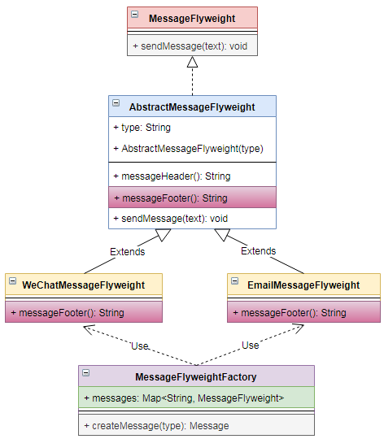

# 享元 `Flyweight`

| :sparkles:模式类型:sparkles::sparkles:|:sparkles::sparkles:难度:sparkles:  :sparkles: | :sparkles::sparkles:实用性:sparkles::sparkles: | :sparkles::sparkles:重要程度:sparkles::sparkles: |  :sparkles::sparkles:经典性:sparkles::sparkles: | :sparkles::sparkles:历史性:sparkles: |
| :----------------------------------------: | :-----------------------------------------------: | :-------------------------------------------------: | :----------------------------------------------------: | :--------------------------------------------------: | :--------------------------------------: |
|                  结构型模式                          |                ★★★★ :arrow_down:                 |                  ★★★★★ :arrow_up:                   |                    ★★★★★ :arrow_up:                    |              :green_heart:  :arrow_up:               |        :green_heart:  :arrow_up:         |

## 概念
享元模式(`Flyweight` )：运用**共享技术**有效地支持**大量细粒度**对象的复用。系统只使用**少量的对象**，而这些对象都**很相似，状态变化很小**，可以**实现对象的多次复用**。由于享元模式要求能够共享的对象必须是细粒度对象，因此它又称为**轻量级模式**，它是一种对象结构型模式。简单来说：它用于通过尽可能多地与类似对象**共享来最小化内存**使用或计算开销。

## 用途
享元模式的主要目的是**实现对象的共享，即共享池**，当系统中对象多的时候可以**减少内存**的开销，通常**与工厂模式一起使用**。运用共享技术有效地支持大量**细粒度**的对象。在有大量对象时，有可能会造成内存溢出，我们把其中**共同的部分抽象出来**，如果有相同的业务请求，直接返回在内存中已有的对象，**避免重新创建**。

面向对象技术可以很好地解决一些灵活性或可扩展性问题，但在很多情况下**需要在系统中增加类和对象的个数**。当对象数量太多时，将导致**运行代价过高，带来性能下降**等问题。
+ 享元模式正是为解决这一类问题而诞生的。享元模式通过共享技术**实现相同或相似对象的重用**。
+ 在享元模式中可以**共享的相同**内容称为**内部状态**(`IntrinsicState`)，而那些需要外部环境来设置的**不能共享**的内容称为**外部状态**(`Extrinsic State`)，由于区分了内部状态和外部状态，因此可以通过设置不同的外部状态使得相同的对象可以具有一些不同的特征，而相同的内部状态是可以共享的。
+ 在享元模式中通常会出现工厂模式，**需要创建一个享元工厂来负责维护一个享元池**(`Flyweight Pool`)用于存储具有相同内部状态的享元对象。
+ 在享元模式中**共享的是享元对象的内部状态**，外部状态需要**通过环境来设置**。在实际使用中，能够共享的内部状态是有限的，因此享元对象一般都**设计为较小的对象**，它所包含的内部状态较少，这种对象也称为**细粒度对象**。享元模式的**目的就是使用共享技术来实现大量细粒度对象的复用**。

## 模式架构
享元模式是一个考虑**系统性能**的设计模式，通过使用享元模式可以**节约内存空间，提高系统的性能**。

享元模式的**核心在于享元工厂类**，享元工厂类的作用在于提供一个用于**存储享元对象的享元池**，用户需要对象时，首先从**享元池中获取，如果享元池中不存在，则创建一个新的享元对象**返回给用户，并在享元池中保存该新增对象。
+ `flyweight` 执行时所需的状态必定是内部的或外部的。内部状态存储于` ConcreteFlyweight` 对象之中；而外部对象则由  **客户端** 对象存储或计算。当用户调用 `flyweight` 对象的操作时，将该状态传递给它。
+ 用户不应直接对 `ConcreteFlyweight` 类进行实例化， 而只能从` FlyweightFactory` 对象得到 `ConcreteFlyweight` 对象，这可以保证对它们适当地进行共享。

+ 享元模式以共享的方式**高效地支持大量的细粒度对象**，享元对象能做到共享的关键是区分内部状态(`Internal State`)和外部状态(`External State`)。
	+ **内部状态**是存储在享元**对象内部**并且**不会随环境改变而改变的状态**，因此**内部状态可以共享**。
	+ **外部状态**是**随环境改变而改变的、不可以共享的状态**。享元对象的外部状态必须**由客户端保存**，并在享元对象被创建之后，在需要使用的时候**再传入到享元对象内部**。一个外部状态与另一个外部状态之间是**相互独立的**。

### 参与角色对象

+ **Flyweight**: 抽象享元类或接口类，定义享元对象的通用接口方法，也就是外部状态方法
+ **ConcreteFlyweight**: 具体享元类，需要继承或实现**Flyweight**类或接口，完成**Flyweight**接口的方法实现，同时提供内部状态设置。它是可以共享的，在**FlyweightFactory**享元工厂类中会使用它
+ **UnsharedConcreteFlyweight**: 非共享具体享元类，不被强制共享的享元类，有些情况下可以不共享一些实现类
+ **FlyweightFactory**: 享元工厂类，提供生产享元实例接口，并完成享元类实例缓存，对享元类实例共享

### UML关系图

## 优点与缺点
+ **优点**
	- 享元模式可以极大**减少内存**中对象的数量、提高系统性能，使得相同对象或相似对象在内存中**只保存一份**。
	- 享元模式的外部状态相对独立，而且不会影响其内部状态，从而使得享元对象可以**在不同的环境中被共享**。
	
+ **缺点**
	- 享元模式使得**系统更加复杂**，需要**分离出内部状态和外部状态**，这使得程序的逻辑复杂化。
	- 为了使对象可以共享，享元模式需要将享元对象的状态外部化，而读取外部状态使得**运行时间变长**。

## 代码实现
享元模式的实现要点如下：
+ 定义**Flyweight**抽象享元类或接口类，本示例中定义一个 `Message`的**Flyweight**接口，并定义好业务方法，也就是**外部状态**
+ **ConcreteFlyweight**具体享元类去实现`Message`的**Flyweight**接口，同时提供内部状态：构造方法和`messageFooter`方法
+ **FlyweightFactory**享元工厂类`MessageFactory`完成享元对象的实例创建`createMessage`，利用集合`Map<String, Message> messages`对象进行实例共享

### 示例参考
+ [享元模式](./java/io/github/hooj0/flyweight/)

## 应用场景
享元模式的有效性在很大程度上取决于它的使用方式和位置。满足以下所有条件时应用`Flyweight`模式：

+ 应用程序使用**大量对象**
+ 由于物体的**数量庞大，存储成本很高**，消耗大量内存
+ 大多数对象**状态可以是外在**的，状态大部分可以**外部化**
+ 一旦外部状态被移除，许多对象组可**被相对较少的共享对象替换**，这些对象可以按照内蕴状态分为很多组，当把外蕴对象从对象中剔除出来时，每一组对象都可以用一个对象来代替
+ 应用程序**不依赖于对象标识**，这些对象是不可分辨的。由于可以共享`flyweight`对象，因此对于概念上不同的对象，**身份测试将返回`true`**。

## 应用实例参考

### `JavaSDK` 
+ `java.lang.Integer#valueOf(int)`
+ `java.lang.Boolean#valueOf(boolean)`
+ `java.lang.Byte#valueOf(byte)`
+ `java.lang.Character#valueOf(char)`

### `GoSDK`

### `PythonSDK`

### `JavaScript Libs`

## 总结

+ 享元模式(`Flyweight` )：运用**共享技术**有效地支持**大量细粒度**对象的复用。系统只使用**少量的对象**，而这些对象都**很相似，状态变化很小**，可以**实现对象的多次复用**。 
+ 享元模式的主要目的是**实现对象的共享，即共享池**，当系统中对象多的时候可以**减少内存**的开销，通常**与工厂模式一起使用**。运用共享技术有效地支持大量**细粒度**的对象。在有大量对象时，有可能会造成内存溢出，我们把其中**共同的部分抽象出来**，如果有相同的业务请求，直接返回在内存中已有的对象，**避免重新创建**。 
+ 面向对象技术可以很好地解决一些灵活性或可扩展性问题，但在很多情况下**需要在系统中增加类和对象的个数**。当对象数量太多时，将导致**运行代价过高，带来性能下降**等问题。 
+ 在享元模式中可以**共享的相同**内容称为**内部状态**(`IntrinsicState`)，而那些需要外部环境来设置的**不能共享**的内容称为**外部状态**(`Extrinsic State`)，由于区分了内部状态和外部状态，因此可以通过设置不同的外部状态使得相同的对象可以具有一些不同的特征，而相同的内部状态是可以共享的。
+ 享元模式可以极大**减少内存**中对象的数量、提高系统性能，使得相同对象或相似对象在内存中**只保存一份；**享元模式的外部状态相对独立，而且不会影响其内部状态，从而使得享元对象可以**在不同的环境中被共享**。
+ 满足以下所有条件时应用`Flyweight`模式：  系统中有大量对象；这些对象消耗大量内存；这些对象的状态大部分可以外部化；系统不依赖于这些对象身份，这些对象是不可分辨的。 

## 参考资料

