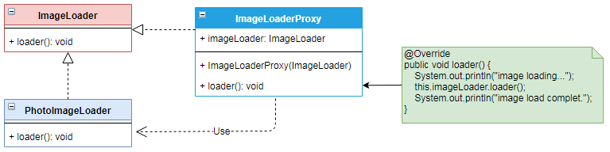

# 代理 `Proxy`

| :sparkles:模式类型:sparkles::sparkles:|:sparkles::sparkles:难度:sparkles:  :sparkles: | :sparkles::sparkles:实用性:sparkles::sparkles: | :sparkles::sparkles:重要程度:sparkles::sparkles: |  :sparkles::sparkles:经典性:sparkles::sparkles: | :sparkles::sparkles:历史性:sparkles: |
| :----------------------------------------: | :-----------------------------------------------: | :-------------------------------------------------: | :----------------------------------------------------: | :--------------------------------------------------: | :--------------------------------------: |
|                    结构型模式                        |                ★★★ :arrow_down:                 |                  ★★★★ :arrow_up:                   |                    ★★★★★ :arrow_up:                    |              :green_heart:  :arrow_up:               |        :green_heart:  :arrow_up:         |

## 概念
代理模式(`Proxy`)：给某一个对象提供一个代理，并由代理对象**控制对原对象的引用**，它是一种对象结构型模式。

在某些情况下，一个客户不想或者**不能直接引用**一个对 象，此时可以通过一个称之为“代理”的第三者来实现**间接引用**。代理对象可以在客户端和目标对象之间起到**中介的作用**，并且可以通过代理对象去掉客户不能看到的内容和服务或者添加客户需要的额外服务。

## 用途
为**其他对象提供一种代理以控制对这个对象的访问**。在直接访问对象时带来的问题，比如说：要访问的对象在远程的机器上。在面向对象系统中，有些对象由于某些原因（比如对象创建开销很大，或者某些操作需要安全控制，或者需要进程外的访问），直接访问会给使用者或者系统结构带来很多麻烦，可以在访问此对象时加上一个对此对象的**访问层**。

通过**引入一个新的对象**（如远程代理对象）来实现对真实对象的操作或者将新的对 象作为真实对象的一个**替身**，这种实现机制即为代理模式，**通过引入代理对象来间接访问一个对象**。

## 模式架构

代理有以下四类：
+ **远程代理（`Remote Proxy`）**：控制对远程对象（不同地址空间）的访问，它负责将请求及其参数进行编码，并**向不同地址空间中的对象发送已经编码的请求**。远程代理可以将**网络的细节隐藏起来**，使得客户端不必考虑网络的存在。客户完全可以认为被代理的远程业务对象是**局域的而不是远程**的，而远程代理对象承担了大部分的网络通信工作。
+ **虚拟代理（`Virtual Proxy`）**：根据需要**创建开销很大**的对象，它可以**缓存实体的附加信息**，以便**延迟对它的访问**，例如在网站加载一个很大图片时，不能马上完成，可以用虚拟代理缓存图片的大小信息，然后生成一张临时图片代替原始图片。
+ **保护代理（`Protection Proxy`）**：按权限控制对象的访问，它负责检查调用者是否具有实现一个请求所必须的访问权限。
+ **智能代理（`Smart Reference`）**：取代了简单的指针，它在访问对象时执行一些附加操作：记录对象的引用次数；当第一次引用一个对象时，将它装入内存；在访问一个实际对象前，检查是否已经锁定了它，以确保其它对象不能改变它。

- **静态代理**
	+ 静态代理在使用时，需要定义接口或者父类`Subject`，被代理对象`RealSubject`与代理对象`Proxy`一起实现相同的接口或者是继承相同父类。
	+ 静态代理模式的特点，代理类接受一个`Subject`接口的对象，任何实现该接口的对象，都可以通过代理类进行代理，增加了通用性。但是也有缺点，每一个代理类都必须实现一遍委托类（也就是`realsubject`）的接口，如果接口增加方法，则代理类也必须跟着修改。其次，代理类每一个接口对象对应一个委托对象，如果委托对象非常多，则静态代理类就非常臃肿，难以胜任。

- **动态代理**
	+ 动态代理是一种较为高级的代理模式，它的典型应用就是`Spring AOP`。
	+ 在传统的代理模式中，客户端通过`Proxy`调用`RealSubject`类的`request()`方法，同时还在代理类中封装了其他方法(如`preRequest()`和`postRequest()`)，可以处理一些其他问题。
	+ 如果按照这种方法使用代理模式，那么**真实主题角色必须是事先已经存在的**，并将其**作为代理对象的内部成员属性**。如果一个真实主题角色必须对应一个代理主题角色，这将导致系统中的类个数急剧增加，因此需要想办法**减少系统中类的个数**，此外，如何在**事先不知道真实主题角色**的情况下使用代理主题角色，这都是**动态代理**需要解决的问题。
	+ 动态代理有别于静态代理，是根据代理的对象，动态创建代理类。这样，就可以避免静态代理中代理类接口过多的问题。动态代理是实现方式，是通过反射来实现的，借助`Java`自带的`java.lang.reflect.Proxy`，通过固定的规则生成。

### 参与角色对象
+ **`Subject`: 抽象主题角色**，主题业务接口定义需要实现的业务方法，代理对象和真实主题对象都需要继承或实现该角色接口
+ **`Proxy`: 代理主题角色**，继承或实现抽象主题角色，接收真实主题的引用，并完成真实业务的代理操作
+ **`RealSubject`: 真实主题角色**，继承或实现抽象主题角色，完成真实业务操作

### UML关系图

## 优点与缺点
+ **优点**
	- 职责清晰，代理模式能够**协调调用者和被调用者**，在一定程度上**降低了系统的耦合度**。
	- 远程代理使得客户端可以**访问在远程机器上的对象**，远程机器可能具有更好的计算**性能与处理速度**，可以快速响应并处理客户端请求。
	- 虚拟代理通过使用一个**小对象来代表一个大对象**，可以**减少系统资源的消耗**，对系统进行优化并提高运行速度。
	- 保护代理可以**控制对真实对象的使用权限**。
	- **静态代理**可以做到在不修改目标对象的功能前提下，对目标功能扩展。
	- **动态代理**可以做到在不修改目标对象的功能前提下，对目标功能扩展。

+ **缺点**
	- 由于在客户端和真实主题之间增加了代理对象，因此有些类型的代理模式可能会**造成请求的处理速度变慢**。
	- 实现代理模式需要**额外的工作**，有些代理模式的实现非常**复杂**。
	- 静态代理模式的代理对象需要与目标对象实现一样的接口，所以会**有很多代理类**，导致类太多。同时，一旦接口增加方法，目标对象与代理对象都要维护修改。

## 代码实现
- **静态代理模式的实现要点如下**：
	+ 定义抽象主题角色接口`Subject`，定义业务方法提供给真实主题角色`RealSubject`和代理主题角色`Proxy`去实现业务方法
	+ 定义真实主题角色`RealSubject`对象，实现抽象主题角色接口`Subject`接口，完成业务方法的处理
	+ 定义代理主题角色`Proxy`，实现抽象主题角色接口`Subject`接口，并且接收构造参数真实主题角色`RealSubject`对象，通过真实主题角色`RealSubject`对象完成`Subject`接口的业务方法处理从而达成代理的效果

- **动态代理模式实现骤如下**：
	+ 编写一个委托类的接口，即静态代理的（`Subject`接口）
	+ 实现一个真正的委托类，即静态代理的（`RealSubject`类）
	+ 创建一个动态代理类，实现`InvocationHandler`接口，并重写该`invoke`方法
	+ 在测试类中，生成动态代理的对象。

### 示例参考
+ [代理模式 - 静态](./java/io/github/hooj0/proxy/_static)
+ [代理模式 - 动态](./java/io/github/hooj0/proxy/_dynamic)

## 应用场景
只要需要比简单指针更通用或更复杂的对象引用，代理就适用。以下是代理模式适用的几种常见情况：
+ **远程(`Remote`)代理**：为一个位于不同的地址空间的对象提供一个本地 的代理对象，这个不同的地址空间可以是在同一台主机中，也可是在 另一台主机中，远程代理又叫做大使(`Ambassador`)。
+ **虚拟(`Virtual`)代理**：如果需要创建一个资源消耗较大的对象，先创建一个消耗相对较小的对象来表示，真实对象**只在需要时才会被真正创建**。
+ **`Copy-on-Write`代理**：它是虚拟代理的一种，把**复制（克隆）操作延迟 到只有在客户端真正需要时才执行**。一般来说，对象的深克隆是一个 开销较大的操作，`Copy-on-Write`代理可以让这个操作延迟，只有对象被用到的时候才被克隆。
+ **保护(`Protect or Access`)代理**：控制对一个对象的访问，可以给不同的用户提供**不同级别的使用权限**。
+ **缓冲(`Cache`)代理**：为某一个目标操作的结果提供临时的存储空间，以便多个客户端可以共享这些结果。
+ **防火墙(`Firewall`)代理**：保护目标**不让恶意用户接近**。
+ **同步化(`Synchronization`)代理**：使几个用户能够同时使用一个对象而没有冲突。
+ **智能引用(`Smart Reference`)代理**：当一个对象被引用时，提供一些额外的操作，如将此对象被调用的次数记录下来等。

## 应用实例参考

### `JavaSDK` 
+ `java.lang.reflect.Proxy`
+ `RMI`
+ [`Apache Commons Proxy`](https://commons.apache.org/proper/commons-proxy/)

### `GoSDK`

### `PythonSDK`

### `JavaScript Libs`

## 总结

## 参考资料

